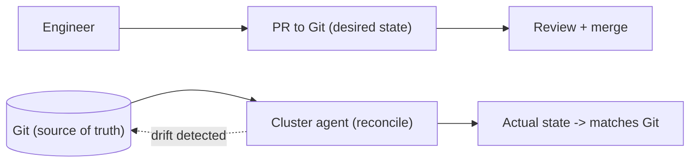

# IaC, Immutable Infrastructure & GitOps

> **Level:** 9 (Cloud-Native) · **Prerequisites:** [Serverless & FaaS](03-serverless-faas.md)
> **Navigation:** [← Previous: Serverless & FaaS](03-serverless-faas.md) · [Next → CI/CD, Deployment Strategies, Feature Flags](05-ci-cd-deployment-feature-flags.md)

## Learning objectives
- Use Infrastructure as Code to make infra reproducible and reviewable.
- Apply immutable infrastructure: replace, don't patch in place.
- Operate via GitOps: Git as the source of truth, reconciled by an agent.

## Infrastructure as Code (IaC)
Define infrastructure declaratively (Terraform/Pulumi/CloudFormation) so it is
reproducible, versioned, reviewable, and disposable. IaC ends ""snowflake"" servers
(manual, irreproducible state) and makes infra a first-class artifact under change
control.

## Immutable infrastructure
Don't **patch in place**; replace. Build a new image/version, deploy it, retire the old.
Immutability means every running instance is identical and known; drift is impossible
because you never mutate live state. Patches become new versions rolled out, not SSH-and-
edit sessions.

## GitOps (S-ARMENTR)
**GitOps**: declare the *desired* state of the system (manifests) in Git; an agent in the
cluster continuously reconciles actual state to Git. Git is the single source of truth and
audit log; deploys are pull-based (the agent pulls), which is more secure and auditable than
push-based pipelines. It extends the Kubernetes reconcile model to delivery.

## Why this matters
IaC + immutability + GitOps turn operations into a versioned, reviewable, self-healing
process: infra is code, instances are replaceable, and the system converges to a reviewed
declaration in Git. This is the operational backbone of cloud-native reliability.

## Examples
- A new config is a PR; on merge, the agent rolls it out; rollback is `git revert`.
- A security patch ships a new image, not an in-place update; old pods retire.
- Drift is auto-corrected because the agent reconciles to Git.

## Trade-offs
- **IaC**: reproducibility/review vs learning curve and state management.
- **Immutable**: consistency/known-state vs image-build lead time and migration effort.
- **GitOps**: audit/security vs the agent as a dependency and reconciliation latency.

## When NOT to apply
- Don't patch live instances (you create a snowflake and lose reproducibility).
- Don't keep infra state outside version control (it drifts).
- Don't run GitOps without monitoring reconciliation failures.

## Common mistakes
- Manual ""quick fixes"" in prod (snowflakes).
- IaC state not backed up / shared (corrupts reproducibility).
- Push-based deploys bypassing the Git source of truth (loses audit).

## Failure modes and operational concerns
- A bad PR reconciled automatically → fleet-wide change; guard with progressive rollouts.
- Reconciliation failure left unnoticed → drift persists.
- IaC state corruption breaking applies.

## Review questions
1. Why replace rather than patch in place?
2. What is GitOps's source of truth, and why pull-based?
3. How does GitOps extend the reconcile model?
4. Give a failure mode of auto-reconcile and a guard.

## Further reading
GitOps: S-ARMENTR · IaC/cloud: S-WA · CI/CD: next.

---
[← Previous: Serverless & FaaS](03-serverless-faas.md) · [Next → CI/CD, Deployment Strategies, Feature Flags](05-ci-cd-deployment-feature-flags.md)
