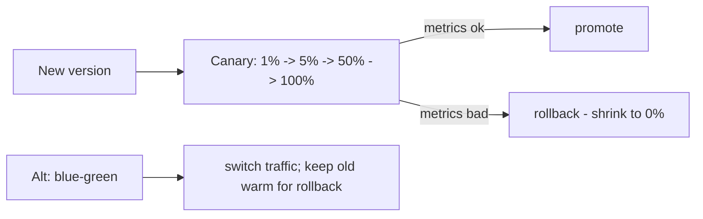

# CI/CD, Deployment Strategies & Feature Flags

> **Level:** 9 (Cloud-Native) · **Prerequisites:** [IaC/Immutable/GitOps](04-iac-immutable-gitops.md)
> **Navigation:** [← Previous: IaC/Immutable/GitOps](04-iac-immutable-gitops.md) · [Next → Autoscaling](06-autoscaling.md)

## Learning objectives
- Distinguish blue-green, canary, and rolling deploys and their rollback behavior.
- Use feature flags to decouple deploy from release and to limit blast radius.
- Reason about progressive delivery and the trade-offs of each strategy.

## CI/CD
**CI** integrates and tests every change; **CD** delivers changes safely (continuously or
on-demand). The goal: small, frequent, safe changes with fast rollback. The longer a
change sits unshipped, the riskier it is.

## Deployment strategies
- **Rolling**: replace instances gradually; no downtime, but old and new coexist briefly
  (needs backward compatibility). Simple default.
- **Blue-green**: run two full environments; switch traffic from blue to green; instant
  switch and instant rollback, but double resources during the switch.
- **Canary**: release to a small % of traffic first, observe, then expand. Limits blast
  radius; needs good metrics to decide promote/abort. The progressive-delivery default.

## Feature flags
A **feature flag** decouples *deploy* from *release*: ship code dark, then enable per
tenant/%/user. This lets you release safely (kill a bad feature without redeploying) and
target rollouts. Cost: flag debt (flags never removed), complexity, and the need to test
every flag combination.

## Why this matters
Deployment and release safety determine how fast you can change without breaking users.
Progressive delivery (canary + flags + good metrics) shrinks the blast radius of every
change to a small slice instead of the whole fleet.

## Examples
- A risky change ships dark behind a flag; enabled for 1% of users; metrics clean → 100%.
- A blue-green switch enables instant rollback when the new version misbehaves.
- A canary aborts automatically when error rate exceeds the threshold.

## Trade-offs
- **Rolling**: simple vs brief coexistence requiring compat.
- **Blue-green**: instant rollback vs double capacity during switch.
- **Canary**: blast-radius control vs needs metrics and traffic-shaping.
- **Flags**: release control vs flag debt and combinatorial testing.

## When NOT to apply
- Don't blue-green a system you can't afford to double in cost.
- Don't add flags you never remove (debt).
- Don't canary without metrics to decide abort — a blind canary is just a slower rollout.

## Common mistakes
- Flags that become permanent, multiplying untested combinations.
- Rolling deploys between incompatible versions (breaking during coexistence).
- Canary without abort criteria (promoting a bad change).

## Failure modes and operational concerns
- A flag left on controlling a path no one remembers (latent bug).
- A canary abort failing to trigger (bad change goes full).
- Blue-green switch exposing a missed stateful dependency.

## Review questions
1. Compare rolling, blue-green, and canary on rollback speed vs cost.
2. What does a feature flag decouple, and what debt does it create?
3. What must a canary have to be meaningful?
4. Give a failure mode of flag debt.

## Further reading
GitOps: previous · SRE: S-GCPSRE · autoscaling: next.

---
[← Previous: IaC/Immutable/GitOps](04-iac-immutable-gitops.md) · [Next → Autoscaling](06-autoscaling.md)
