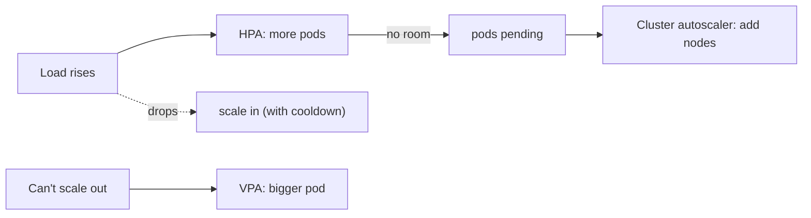

# Autoscaling: HPA, VPA, Cluster Autoscaling

> **Level:** 9 (Cloud-Native) · **Prerequisites:** [CI/CD & Feature Flags](05-ci-cd-deployment-feature-flags.md)
> **Navigation:** [← Previous: CI/CD & Feature Flags](05-ci-cd-deployment-feature-flags.md) · [Next → Cloud Networking, VPC, Hybrid/Multi-Cloud, Edge](07-cloud-networking.md)

## Learning objectives
- Distinguish horizontal (HPA), vertical (VPA), and cluster autoscaling.
- Reason about autoscaling triggers, cooldown, and oscillation.
- Avoid the over-scaling trap (scaling that worsens overload).

## The three kinds
- **Horizontal Pod Autoscaler (HPA)**: add/remove pod replicas based on metrics (CPU, RPS,
  custom). The default for stateless services.
- **Vertical Pod Autoscaler (VPA)**: resize a pod's CPU/memory. Useful when a workload
  can't scale out (a single-instance stateful service), but you can't usually run two sizes
  at once.
- **Cluster autoscaler**: add/remove **nodes** when pods can't be scheduled (or nodes are
  underused). Necessary because HPA needs somewhere to put new pods.

## Triggers, cooldown, oscillation
Autoscale on **leading** indicators (queue depth, RPS) not just lagging ones (CPU).
**Cooldowns** and stabilization windows prevent flapping. **Oscillation** (scaling in/out
rapidly) wastes resources and harms latency; tune with stabilization windows and step
sizes.

## The over-scaling trap
Autoscaling does not fix an overloaded *dependency*. If a database is the bottleneck,
adding app replicas just adds waiters to the same queue and makes things worse. Scale the
bottleneck, or shed load (Level 6).

## Why this matters
Autoscaling converts capacity planning (Level 1) into an automated, demand-following
process — but only for the parts that *can* scale. It complements, not replaces,
provisioning headroom and good architecture.

## Examples
- HPA scales a stateless API on RPS; cluster autoscaler adds nodes when pods are pending.
- A queue-driven worker autoscales on queue depth (a leading indicator).
- A single-shard stateful service uses VPA (can't scale out) plus read replicas for reads.

## Trade-offs
- **HPA**: elastic stateless scale vs needs the work to be parallelizable and stateless.
- **VPA**: fits the unscale-out-able vs restarts to resize (disruptive) and single-size.
- **Cluster autoscaler**: enables HPA vs node startup latency and cost of spare capacity.

## When NOT to apply
- Don't autoscale around a bottleneck; fix the bottleneck or shed load.
- Don't autoscale a stateful shard by replication naively (consistency/write contention).
- Don't rely on autoscale to provision during a spike too fast to start nodes (keep
  buffer).

## Common mistakes
- Scaling on lagging CPU only (too slow), causing oscillation or under-provisioning.
- Autoscaling app replicas while the DB stays the bottleneck.
- No cooldown → flapping.

## Failure modes and operational concerns
- Node startup latency too slow for spikes (keep buffer capacity).
- Autoscaler thrashing under noisy metrics.
- Scaling in too aggressively killing warm pods needed for in-flight work.

## Review questions
1. Distinguish HPA, VPA, and cluster autoscaling.
2. Why scale on leading indicators with cooldowns?
3. Why doesn't autoscaling fix an overloaded dependency?
4. Give an oscillation failure and a tuning fix.

## Further reading
Capacity planning: Level 1 · overload: Level 6 · SRE: S-GCPSRE.

---
[← Previous: CI/CD & Feature Flags](05-ci-cd-deployment-feature-flags.md) · [Next → Cloud Networking, VPC, Hybrid/Multi-Cloud, Edge](07-cloud-networking.md)
