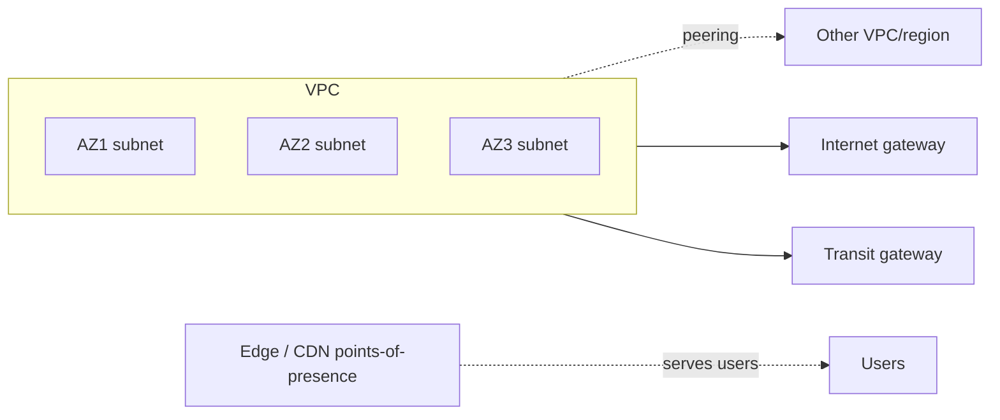

# Cloud Networking, VPC, Hybrid/Multi-Cloud & Edge

> **Level:** 9 (Cloud-Native) · **Prerequisites:** [Autoscaling](06-autoscaling.md)
> **Navigation:** [← Previous: Autoscaling](06-autoscaling.md) · [Next → Platform Engineering & IDP](08-platform-engineering-idp.md)

## Learning objectives
- Reason about VPCs, subnets, and the cloud network model.
- Distinguish hybrid, multi-cloud, and edge and their drivers.
- Reason about networking as a constraint on multi-region and multi-cloud designs.

## VPCs and cloud networking
A **VPC** is a private, isolated network in the cloud where you define subnets, route
tables, security groups, and peering. Networking choices constrain availability: a subnet
per AZ gives zonal isolation; peering/transit gateways connect VPCs; egress costs shape
architectures (co-locate, use CDNs).

## Hybrid, multi-cloud, edge
- **Hybrid cloud**: on-prem + cloud; for data gravity, regulation, or migration. Adds
  network and consistency complexity.
- **Multi-cloud**: use multiple clouds; for negotiating power, avoiding lock-in, or best-of
  -breed. High operational complexity and cross-cloud consistency challenges.
- **Edge**: compute/cache near users (CDN, edge compute); cuts latency and origin egress.

## Why this matters
Networking constrains availability, latency, and cost. Multi-region/multi-cloud ambitions
live or die on networking and data-consistency decisions, not on compute. Egress and
latency often dominate cost/latency, making edge and co-location architectural levers.

## Examples
- A VPC with a subnet per AZ for zonal isolation; a transit gateway connects to a partner
  VPC.
- A hybrid setup keeps regulated data on-prem and analytics in cloud, joined by a private
  link.
- Edge compute runs personalization near users, cutting both latency and origin egress.

## Trade-offs
- **Hybrid/multi-cloud**: flexibility/leverage vs operational complexity and cross-cloud
  consistency.
- **Edge**: latency/egress savings vs running compute at many sites and consistency of edge
  state.

## When NOT to apply
- Don't go multi-cloud without a strong reason; the operational cost is large.
- Don't design cross-cloud consistency by hand; pick stores that handle it or constrain
  writes.
- Don't put latency-critical global serving far from users; use the edge.

## Common mistakes
- Ignoring egress cost until the bill spikes.
- Cross-cloud designs that hand-roll consistency (painful, buggy).
- Multi-cloud ""for redundancy"" without testing actual failover across clouds.

## Failure modes and operational concerns
- Peering/transit limits causing throttling at scale.
- Multi-cloud failover never tested across providers.
- Edge state diverging from origin without a sync strategy.

## Review questions
1. Why do networking choices constrain availability and cost?
2. Give a strong reason and a strong reason against multi-cloud.
3. How does edge help latency and egress?
4. Give a hybrid-cloud consistency challenge.

## Further reading
DNS/proxies/CDN: Level 2 · multi-region: Level 10 · IDP: next.

---
[← Previous: Autoscaling](06-autoscaling.md) · [Next → Platform Engineering & IDP](08-platform-engineering-idp.md)
