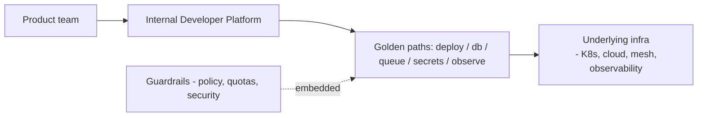

# Platform Engineering & Internal Developer Platforms

> **Level:** 9 (Cloud-Native) · **Prerequisites:** [Cloud Networking](07-cloud-networking.md)
> **Navigation:** [← Previous: Cloud Networking](07-cloud-networking.md) · [Next → Level 10: Extreme-Scale](../10-extreme-scale/README.md)

## Learning objectives
- Explain platform engineering: productizing internal infrastructure as a platform.
- Reason about an Internal Developer Platform (IDP) and golden paths.
- Balance self-service vs guardrails.

## Platform engineering
Instead of every team building the same infrastructure, a **platform team** productizes a
shared platform (deployment, observability, databases, secrets, networking) as an
**Internal Developer Platform**. The platform is treated as a **product** with developers
as customers; it codifies best practices as defaults so teams move fast safely.

## Golden paths
A **golden path** is the supported, opinionated way to do a common task (""deploy a stateless
service,"" ""add a queue""). It's faster and safer than DIY and bakes in the standards
(observability, resilience, security). Teams can leave the path, but the path is the easy
default.

## Self-service vs guardrails
Self-service lets teams provision without tickets; guardrails (policy-as-code, quotas,
security defaults) keep them safe. The goal: **self-service within safe defaults**, not
free-for-all or gate-everything.

## Why this matters
An IDP scales the platform team's expertise across the org: every team gets the SRE-grade
defaults (observability, resilience, security) without each hiring those skills. It is the
organizational complement to the cloud-native primitives in this level.

## Examples
- A developer ""deploys a service"" via the IDP and gets autoscaling, metrics, mTLS, and
  secrets wired by default.
- A golden path for "add a queue" provisions the queue, the DLQ, and dashboards in one
  request.
- Policy-as-code blocks non-compliant configs at provision time (a guardrail).

## Trade-offs
- **IDP**: scales expertise and speed vs platform-team investment and the risk of an
  overly rigid platform.
- **Golden paths**: easy defaults vs the need to support off-path needs (don't force-fit).
- **Self-service**: speed vs the blast radius of mistakes (mitigate with guardrails).

## When NOT to apply
- Don't build an IDP before common patterns repeat (premature platform).
- Don't make the platform so rigid teams route around it (shadow IT).
- Don't gate everything behind tickets (kills the speed benefit).

## Common mistakes
- A platform nobody uses (not treated as a product; no developer buy-in).
- Golden paths that don't cover the common cases (teams leave the path constantly).
- Self-service without guardrails → security/consistency incidents.

## Failure modes and operational concerns
- Platform outages affecting every product team (a central dependency).
- Stale golden paths that don't track infra changes.
- Off-path teams reinventing unsafe infrastructure.

## Review questions
1. What does a platform team productize, and for whom?
2. What is a golden path and what does it bake in?
3. Balance self-service and guardrails; what's the failure of each extreme?
4. Why must an IDP be treated as a product?

## Further reading
SRE: S-GCPSRE · GitOps: earlier · cloud Well-Architected: S-WA.

---
[← Previous: Cloud Networking](07-cloud-networking.md) · [Next → Level 10: Extreme-Scale](../10-extreme-scale/README.md)
