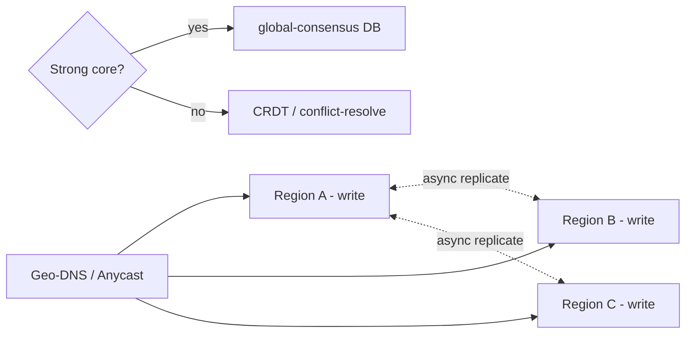

# Global Routing, Multi-Region Writes & Cross-Region Replication

> **Level:** 10 (Extreme-Scale) · **Prerequisites:** [Level 9](../09-cloud-platform/README.md)
> **Navigation:** ← Start of Level 10 · [Next → Geo-Partitioning & Data Sovereignty](01-geo-partitioning-sovereignty.md)

## Learning objectives
- Use geo-DNS/Anycast + health-checked LB for global routing.
- Reason about multi-region writes and their consistency cost.
- Choose a cross-region replication topology for latency vs consistency.

## Global routing
At extreme scale, route users to the nearest healthy region via **geo-DNS / Anycast** and
health-checked load balancing (Level 2 DNS, taken global). The challenge: when a region
fails, move traffic *fast* — short TTLs + active health checks, since DNS TTL is too coarse
for sub-minute failover.

## Multi-region writes
Single-region writes are simple but force all users to one region (latency for distant
users). **Multi-region writes** let each region accept writes for nearby users, slashing
write latency. The cost: **cross-region consistency**. Options:
- **Active-passive with a single writer** for the strongly-consistent core; regional writes
  route to the primary.
- **Multi-leader** with conflict resolution (CRDTs, last-writer-wins, app-merge) for data
  that tolerates divergence.
- **Globally consistent DB** (Spanner-style, S-SPANNER): true multi-region strong consistency
  via global consensus + TrueTime; pays cross-region round-trip latency on writes.

## Cross-region replication
- **Async** for low write latency and partition tolerance (eventual across regions).
- **Sync** for strong cross-region consistency (rare; very high write latency).
- **Geo-partitioning** (next chapter) keeps data *and* its writes in the region that owns
  it, avoiding cross-region write latency for region-local data.

## Why this matters
Global latency and surviving a region loss are the defining extreme-scale challenges.
Multi-region writes buy latency at the price of consistency complexity; the design must
state, per data type, which consistency it offers users.

## Examples
- A global app: user profiles multi-leader (CRDT) for fast regional edits; a banking ledger
  single-writer for strong consistency.
- A region loss fails over via geo-DNS to a healthy region; async-replicated data is current
  up to replication lag.
- A globally-consistent counter uses a Spanner-style DB so all regions see one value.

## Trade-offs
- **Multi-region writes**: latency vs cross-region consistency complexity and conflict risk.
- **Async replication**: low latency vs region-loss data loss up to lag.
- **Global-consensus DB**: strong consistency vs cross-region write latency.

## When NOT to apply
- Don't multi-region-write data needing strong consistency without a global-consensus store.
- Don't assume async replication gives zero RPO (region loss loses unreplicated writes).
- Don't rely on DNS TTL alone for fast failover; add health-checked LB.

## Common mistakes
- Multi-leader without a conflict policy (silent data loss).
- Cross-region writes expecting strong consistency from an eventually-consistent store.
- Failover tests never run across regions.

## Failure modes and operational concerns
- A region loss losing async-replicated writes (RPO > 0).
- Conflict-resolution policies that silently drop concurrent edits.
- Cross-region replication lag surprising users with stale reads.

## Review questions
1. Why is DNS TTL too coarse for fast failover?
2. Compare single-writer, multi-leader, and global-consensus for multi-region writes.
3. What RPO does async cross-region replication imply on region loss?
4. When does a CRDT fit multi-region writes?

## Further reading
CAP/PACELC: Level 4 · Spanner: S-SPANNER · CRDTs: Level 4.

---
← Start of Level 10 · [Next → Geo-Partitioning & Data Sovereignty](01-geo-partitioning-sovereignty.md)
