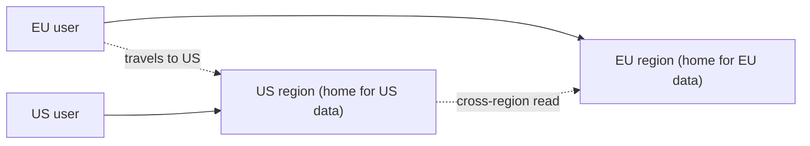

# Geo-Partitioning & Data Sovereignty

> **Level:** 10 (Extreme-Scale) · **Prerequisites:** [Global Routing](00-global-routing-multi-region.md)
> **Navigation:** [← Previous: Global Routing](00-global-routing-multi-region.md) · [Next → Edge Compute & Millions of Connections](02-edge-compute.md)

## Learning objectives
- Use geo-partitioning to keep data and its writes co-located by region.
- Enforce data sovereignty (data residency) by design.
- Reason about globally-shared vs region-local data trade-offs.

## Geo-partitioning
**Geo-partitioning** assigns each piece of data to a home region (by tenant, country, or
user), so writes stay in-region (fast) and reads of that data are served locally. It
avoids the cross-region write-latency of multi-region-all data, at the cost of
**cross-region reads** when a user is away from their data's home.

## Data sovereignty
**Data sovereignty/residency** requires some data to stay within a jurisdiction (GDPR,
sector rules). Enforce by *design*: a routing layer pins a user's data to its home region
and forbids replication outside. This is not a runtime filter; it's a placement rule with
audit.

## Globally-shared vs region-local
Some data is genuinely global (catalog, configs) and should be replicated to all regions
for local reads; some is region-local (PII, financial records) and must stay put. Split
them: a globally-replicated read-mostly layer + a region-local authoritative layer.

## Why this matters
At global scale, *where data lives* determines both latency and legality. Geo-partitioning
solves write latency and residency simultaneously; getting it wrong means either slow
cross-region writes or a compliance breach.

## Examples
- A multi-tenant SaaS pins each tenant to a home region; writes are local, reads elsewhere
  are cross-region.
- EU user data never leaves the EU region; a routing layer enforces placement and audit.
- A global catalog is replicated read-only to every region; user data is region-local.

## Trade-offs
- **Geo-partitioning**: local writes + residency vs cross-region reads for travelers.
- **Global-replicated reads**: fast everywhere vs replication cost and write latency for
  the global object.

## When NOT to apply
- Don't replicate regulated data globally (residency breach).
- Don't geo-partition data that's genuinely global and read-heavy (just replicate it).
- Don't make travelers' reads silently slow without a strategy.

## Common mistakes
- Cross-region reads for travelers without caching or a "home region" hint.
- Sovereignty enforced as a runtime filter rather than placement.
- Replicating a global object synchronously (huge write latency).

## Failure modes and operational concerns
- A residency misconfiguration leaking data across a border.
- Cross-region read latency spiking for traveling users.
- Re-balancing a tenant's home region (rare, painful; plan it).

## Review questions
1. How does geo-partitioning solve write latency and residency at once?
2. Why is sovereignty a placement rule, not a runtime filter?
3. When should data be globally replicated vs region-local?
4. Give a traveler's-read failure and a mitigation.

## Further reading
Sharding: Level 3 · multi-region: previous · edge: next.

---
[← Previous: Global Routing](00-global-routing-multi-region.md) · [Next → Edge Compute & Millions of Connections](02-edge-compute.md)
