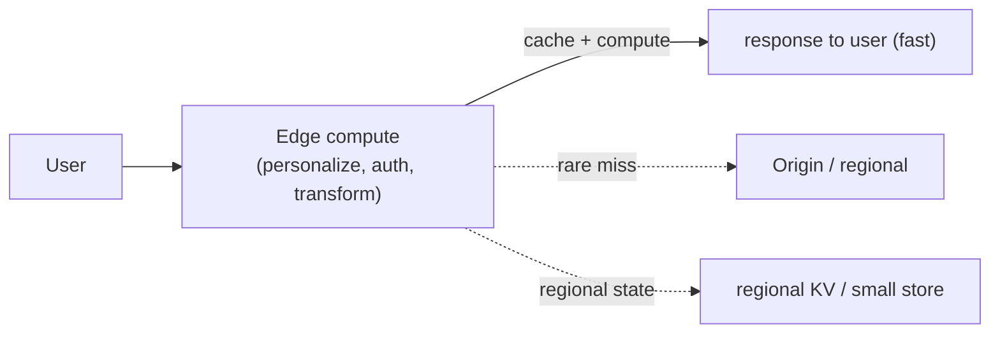

# Edge Compute & Millions of Concurrent Connections

> **Level:** 10 (Extreme-Scale) · **Prerequisites:** [Geo-Partitioning](01-geo-partitioning-sovereignty.md)
> **Navigation:** [← Previous: Geo-Partitioning](01-geo-partitioning-sovereignty.md) · [Next → Billion-User & PB/EB Platforms](03-billion-user-pb-eb.md)

## Learning objectives
- Run compute (not just cache) at the edge near users.
- Support millions of concurrent connections per host.
- Reason about edge state consistency and origin offload.

## Edge compute
Beyond caching content (Level 2), **edge compute** runs logic near users: personalization,
auth, A/B, image transforms, light inference. It cuts latency and origin egress/round trips,
and lets the origin stay out of the hot path. Edge functions are short-lived, stateless
(or with limited regional state), and limited in runtime — design accordingly.

## Millions of concurrent connections
Holding a connection per user at scale (chat, push, real-time) requires the **async I/O /
event loop** model from Level 0: tens to hundreds of thousands of connections per host via
`epoll`/`io_uring`, not one thread per connection. Gateways that hold connection state are
**stateful** — shard by user/connection id, replicate presence, and plan failover (Level 1).

## Why this matters
Edge compute and connection-scale handling are what make a system feel instant to a billion
users while keeping the origin calm. The recurring lesson: keep the hot path at the edge,
stateless, and asynchronous; let the origin handle only the irreducible stateful work.

## Examples
- An edge function personalizes a page and caches the result, never hitting the origin.
- A push gateway holds 500k connections per host via an event loop; presence is replicated.
- Image resizing runs at the edge, returning a transformed image without an origin round
  trip.

## Trade-offs
- **Edge compute**: latency/egress wins vs limited runtime and edge-state consistency.
- **Connection-scale**: high concurrency vs statefulness and failover complexity.

## When NOT to apply
- Don't put heavy/stateful logic at the edge (runtime limits, consistency).
- Don't hold connections one-thread-per-conn at millions scale (exhausts resources).
- Don't replicate edge state synchronously to the origin (defeats the edge).

## Common mistakes
- Edges calling the origin on every request (no offload).
- Thread-per-connection at million-connection scale.
- Unbounded edge state without a consistency/eviction plan.

## Failure modes and operational concerns
- Edge function cold-starts under burst.
- A stateful gateway node loss dropping connections (reconnect + presence reconcile).
- Edge state diverging from origin.

## Review questions
1. What does edge compute buy beyond caching?
2. How do you hold millions of connections per host?
3. Why are connection gateways stateful, and what does that imply?
4. Give an edge-state consistency failure.

## Further reading
Async I/O: Level 0 · CDN/caching: Level 2 · stateful scaling: Level 1.

---
[← Previous: Geo-Partitioning](01-geo-partitioning-sovereignty.md) · [Next → Billion-User & PB/EB Platforms](03-billion-user-pb-eb.md)
