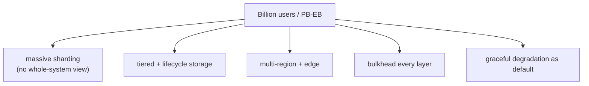

# Billion-User Systems & Petabyte/Exabyte Platforms

> **Level:** 10 (Extreme-Scale) · **Prerequisites:** [Edge Compute](02-edge-compute.md)
> **Navigation:** [← Previous: Edge Compute](02-edge-compute.md) · [Next → Stream & Real-Time Analytics](04-stream-realtime-analytics.md)

## Learning objectives
- Reason about the qualitative shifts at billion-user and PB/EB scale.
- Apply sharding, replication, and tiering at scales where ""add a bigger box"" no longer
  works.
- Reason about the operational cost of operating at this scale (people, cost, failure).

## The qualitative shift
Below a certain scale, most problems are solved by ""add capacity."" At billion-user / PB-EB
scale, every assumption breaks: a single hot key melts a shard; a deploy touches a billion
sessions; a bad config affects everyone; egress and storage dominate cost; a single region
isn't enough. The whole architecture is about **partitioning, replication, and graceful
degradation** so no single component sees the whole.

## Patterns at this scale
- **Aggressive sharding + consistent hashing** with many shards and vnodes (Level 3).
- **Read replicas + caching at multiple layers** so reads rarely hit the authoritative
  store.
- **Tiered storage** with automated lifecycle (hot → warm → cold; Level 3).
- **Multi-region** for latency and survivability (this level).
- **Bulkheading everything** so a failure is a slice, not the whole (Level 5/6).

## Operational reality
At this scale, **people and process** matter as much as architecture: dedicated SREs,
gradual rollouts, feature flags everywhere, careful capacity headroom, and a culture of
postmortems. A single bad change can affect a billion users, so progressive delivery and
reversibility are non-negotiable.

## Why this matters
Billion-user scale is where architecture and operations fuse: a technically-correct design
fails operationally if a deploy can take down everyone. The discipline is reducing blast
radius everywhere (sharding, canaries, bulkheads, degradation).

## Examples
- A social feed sharded by user with many replicas; a viral post handled by edge + counts
  aggregation, not by a single shard.
- A PB-scale data platform tiers cold data automatically; only recent data is on hot
  storage.
- Every change ships behind flags and a 1% canary; a bad change is shrunk, not global.

## Trade-offs
- **Massive sharding**: scale vs cross-shard operations and rebalancing pain.
- **Tiering**: cost vs recall latency.
- **Degradation everywhere**: resilience vs the risk of silently-normalized degraded
  experience.

## When NOT to apply
- Don't build billion-user architecture before you have the load (premature cost/complexity).
- Don't degrade silently without alerting (chronic degradation becomes the norm).
- Don't shard so finely that metadata/coordination overhead dominates.

## Common mistakes
- Assuming ""add capacity"" still works at this scale.
- A single hot key unmitigated (a billion-user post on one shard).
- Deploys that can affect everyone at once (no canary/flag).

## Failure modes and operational concerns
- A config push affecting all regions simultaneously.
- A hot entity melting its shard.
- Cost runaway from un-tiered cold data.

## Review questions
1. What qualitatively changes at billion-user/PB-EB scale?
2. Why does blast-radius reduction dominate the design?
3. Why must deploys be progressive and reversible at this scale?
4. Give a hot-key failure and its mitigation.

## Further reading
Sharding/tiering: Level 3 · multi-region: previous chapters · SRE: S-GCPSRE.

---
[← Previous: Edge Compute](02-edge-compute.md) · [Next → Stream & Real-Time Analytics](04-stream-realtime-analytics.md)
