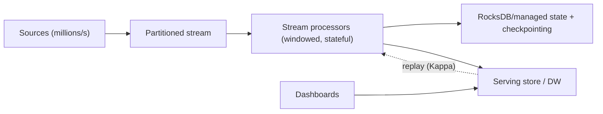

# High-Frequency Event Processing, Stream & Real-Time Analytics

> **Level:** 10 (Extreme-Scale) · **Prerequisites:** [Billion-User/PB-EB](03-billion-user-pb-eb.md)
> **Navigation:** [← Previous: Billion-User/PB-EB](03-billion-user-pb-eb.md) · [Next → Large-Scale Graph & Search](05-large-scale-graph-search.md)

## Learning objectives
- Build high-throughput, low-latency stream processing at extreme event rates.
- Reason about windowing, watermarks, and exactly-once at scale.
- Combine streams with batch for accuracy (Lambda) or pure-stream (Kappa).

## High-frequency event processing
At millions of events/sec, you partition a stream by key (Level 3/4), process per
partition, and scale consumers with partitions. The hard parts: **windowing** (tumbling,
sliding, session), **watermarks** (how late is "too late"), and **backpressure** (Level 6)
when consumers can't keep up.

## Stream vs real-time analytics
- **Stream processing**: continuous transforms/aggregations on the live event stream
  (counts, joins, anomaly detection) with low latency.
- **Real-time analytics**: serving precomputed or on-demand aggregates to dashboards/queries
  with sub-second latency, often backed by a fast OLAP/serving store.

## Exactly-once at scale
True network exactly-once is generally impossible (Level 4); stream processors achieve
**effectively-once** via checkpointing (snapshots) + idempotent sinks: a failure restores
from a snapshot and replays; the dedup/idempotency prevents double-application. This is
where CRDTs/snapshots (Level 4) appear in practice.

## Why this matters
Real-time decisions (fraud, pricing, monitoring) need events processed at scale within
seconds. The architecture is stream-first, partitioned, with snapshot recovery and idempotent
sinks — the Kappa model when the stream is replayable.

## Examples
- A fraud pipeline scores events in <1s via a partitioned stream + stateful processors.
- A metrics platform aggregates per-minute windows with watermarks; late events update a
  window until the watermark closes it.
- A real-time dashboard reads a serving store updated by the stream, giving sub-second
  updates without querying raw events.

## Trade-offs
- **Latency vs accuracy**: lower latency often means approximate early windows.
- **Watermarks**: tighter = drop late events; looser = more latency.
- **Stream-only (Kappa) vs stream+batch (Lambda)**: simplicity vs needing a replayable
  stream.

## When NOT to apply
- Don't build real-time pipelines for data that's fine hourly (batch is cheaper/simpler).
- Don't claim exactly-once without checkpoints + idempotent sinks.
- Don't size partitions so few that a hot key overwhelms one processor.

## Common mistakes
- No watermark → unbounded waiting for late events.
- Non-idempotent sinks → double counts on replay.
- Too few partitions for the skew (hot-key stragglers).

## Failure modes and operational concerns
- Consumer lag growing unbounded under sustained rate (scale partitions/consumers).
- Checkpoint failures breaking exactly-once recovery.
- Late events dropped silently by an aggressive watermark.

## Review questions
1. How does a stream processor achieve effectively-once at scale?
2. What trade-off does a watermark encode?
3. When is Kappa simpler than Lambda, and what must hold?
4. Give a hot-key failure in a stream and its mitigation.

## Further reading
Kafka: S-KAFKA · MapReduce/Lambda/Kappa: Level 5 · CRDTs/snapshots: Level 4.

---
[← Previous: Billion-User/PB-EB](03-billion-user-pb-eb.md) · [Next → Large-Scale Graph & Search](05-large-scale-graph-search.md)
