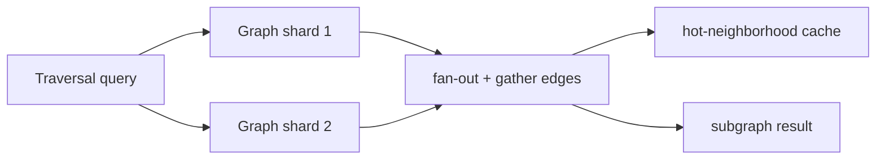

# Large-Scale Graph Processing & Search

> **Level:** 10 (Extreme-Scale) · **Prerequisites:** [Stream/Real-Time Analytics](04-stream-realtime-analytics.md)
> **Navigation:** [← Previous: Stream/Real-Time Analytics](04-stream-realtime-analytics.md) · [Next → Distributed ML, Feature Stores, Model Serving](06-ml-feature-stores-serving.md)

## Learning objectives
- Reason about partitioning graphs (hard: locality vs balance) for traversal at scale.
- Build large-scale search with sharded inverted indexes and distributed query fan-out.
- Reason about reindexing and freshness at search scale.

## Large-scale graph processing
Graph workloads (recommendations, fraud rings, social traversal) need multi-hop traversals.
Sharding a graph is hard: **locality** (co-locate a node with its edges) conflicts with
**balance** and with traversal that crosses partitions. Two approaches:
- **Graph-parallel batch** (Pregel/GraphX-style): think like-a-vertex, message-pass in
  supersteps (PageRank, connected components). MapReduce-like; batch latency.
- **Graph databases / sharded adjacency**: for online traversal; shard by node id and
  accept cross-partition hops, caching hot neighborhoods.

## Large-scale search
A search engine shards the **inverted index** across nodes; a query fans out to the shards
holding the relevant terms, each returns partial top-k, and a **gather** node merges to
global top-k. Sharding by document or by term has different trade-offs; document-sharding
with per-shard top-k + merge is common.

## Reindexing and freshness
The index is a derived store (Level 3 CDC); updates lag. At scale, **reindexing** a new
schema/version is expensive — do it with a parallel new index, switch traffic gradually
(canary), then retire the old. Freshness is bounded by the CDC pipeline lag.

## Why this matters
Graph and search are the workloads where naive scaling fails hardest: graph locality fights
partitioning, and search fan-out is expensive. Both need purpose-built sharding and careful
query planning.

## Examples
- A recommendation graph: sharded adjacency + hot-neighborhood cache; batch graph-parallel
  jobs precompute embeddings offline.
- A web-scale search: document-sharded inverted index; per-shard top-k + gather merge;
  schema changes via parallel-index canary.
- A fraud-ring detector: graph-parallel connected-components on a batch snapshot, refreshed
  periodically.

## Trade-offs
- **Graph sharding**: locality vs balance vs cross-partition hop cost.
- **Search sharding**: document-shard (simple fan-out) vs term-shard (fewer lookups,
  unbalanced).
- **Reindex**: parallel-index canary (safe, costly) vs in-place (risky, cheap).

## When NOT to apply
- Don't use a graph DB for key-lookup workloads (use KV).
- Don't fan out search to every shard for every query; route by term/term-partition where
  possible.
- Don't reindex in place at search scale (risky).

## Common mistakes
- Graph traversal fanning out to all partitions per hop (explosive).
- Search fan-out to all shards with no per-shard top-k (huge transfer).
- In-place reindex locking the index.

## Failure modes and operational concerns
- A traversal hot spot overwhelming a partition.
- Query fan-out amplifying tail latency (waits for the slowest shard).
- Reindex cutover causing a freshness or correctness gap.

## Review questions
1. Why is sharding a graph fundamentally hard?
2. Describe document-sharded search query flow with per-shard top-k.
3. How do you reindex safely at search scale?
4. Give a graph-traversal failure and a mitigation.

## Further reading
Bigtable: S-BIGTABLE · MapReduce: S-MAPREDUCE · search: Level 2/3.

---
[← Previous: Stream/Real-Time Analytics](04-stream-realtime-analytics.md) · [Next → Distributed ML, Feature Stores, Model Serving](06-ml-feature-stores-serving.md)
