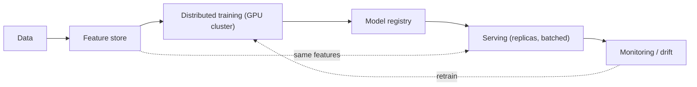

# Distributed ML, Feature Stores & Model Serving

> **Level:** 10 (Extreme-Scale) · **Prerequisites:** [Large-Scale Graph & Search](05-large-scale-graph-search.md)
> **Navigation:** [← Previous: Large-Scale Graph & Search](05-large-scale-graph-search.md) · [Next → Vector Search & RAG](07-vector-search-rag.md)

## Learning objectives
- Distinguish training, feature stores, and serving, and their scale concerns.
- Reason about distributed training and serving latency/throughput on accelerators.
- Reason about model versioning, rollback, and the ML system as a data pipeline.

## The ML system as a pipeline
An ML system is a data pipeline: **data → features → training → model registry → serving →
monitoring → retraining**. The serving path is an inference system; the training path is a
batch/stream pipeline. Decouple them via a **feature store** (shared, consistent features
for both training and serving) to avoid train/serve skew.

## Feature stores
A **feature store** provides consistent feature definitions and values for *both* training
  and serving, eliminating skew (training computed one feature value, serving another). It
  pairs a batch store (history) and an online store (low-latency serving values).

## Distributed training & serving
- **Training** is compute-heavy and often distributed across many GPUs/TPUs (data
  parallel, model parallel, pipeline parallel); checkpointing enables resumability.
- **Serving** needs low-latency inference: batch requests for throughput, replicas for
  scale, accelerators (GPUs) where the model demands them, autoscaling on request rate.
- **Versioning/rollback**: a model is an artifact with a version; serve new models
  gradually (canary) and keep the old for instant rollback.

## Why this matters
ML systems fail operationally more than statistically: train/serve skew, drift, model
regressions in production, and serving latency. Treating the ML system as a monitored,
versioned, reversible pipeline (not a one-shot notebook) is what makes it operable.

## Examples
- A recommendation model: features from the feature store (same for train/serve); training
  on a GPU cluster; canary serving; drift triggers retraining.
- A serving path batches inference requests for GPU throughput and autoscales on QPS.
- A bad model version is rolled back instantly because the registry keeps prior versions.

## Trade-offs
- **Batching for throughput** vs added latency (wait to fill a batch).
- **Accelerators** for speed vs cost and cold-start; autoscale to pay only when used.
- **Canary a model** vs the risk that online distribution differs from training.

## When NOT to apply
- Don't compute features differently in training vs serving (skew).
- Don't ship a model with no rollback path.
- Don't serve on accelerators for a low-QPS, latency-tolerant model (overkill/cost).

## Common mistakes
- Train/serve feature skew (silent accuracy loss).
- No drift monitoring (model degrades unnoticed).
- Serving a new model to everyone at once (no canary/rollback).

## Failure modes and operational concerns
- Drift silently degrading predictions; monitor and retrain.
- A model serving path cold-starting accelerators under a burst.
- Incompatible feature schema between training and serving.

## Review questions
1. Why use a feature store for both training and serving?
2. How do you serve a new model safely?
3. What is train/serve skew and how does it arise?
4. Why batch inference requests, and what's the cost?

## Further reading
MapReduce: S-MAPREDUCE · GPU clusters: next · serving at scale: Level 9.

---
[← Previous: Large-Scale Graph & Search](05-large-scale-graph-search.md) · [Next → Vector Search & RAG](07-vector-search-rag.md)
