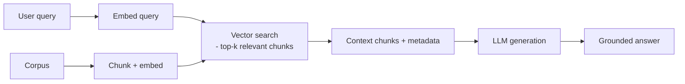

# Vector Search & Retrieval-Augmented Generation (RAG)

> **Level:** 10 (Extreme-Scale) · **Prerequisites:** [Distributed ML & Serving](06-ml-feature-stores-serving.md)
> **Navigation:** [← Previous: Distributed ML & Serving](06-ml-feature-stores-serving.md) · [Next → GPU Clusters & Batch Scheduling](08-gpu-batch-scheduling.md)

## Learning objectives
- Explain vector search (approximate nearest neighbor) and its trade-offs.
- Build a RAG pipeline: retrieve relevant context, then generate.
- Reason about indexing cost, recall, and latency at vector-search scale.

## Vector search (S-VECTORDB)
A **vector database** stores embeddings and answers similarity queries (nearest neighbors)
via **approximate nearest-neighbor (ANN)** indexes (HNSW, IVF, PQ). Exact search is
intractable at scale; ANN trades recall for speed. Tunable: index build cost, recall,
latency, and memory. Vector search backs semantic search, dedup, and RAG.

## RAG (S-RAG)
**Retrieval-Augmented Generation** retrieves relevant context for a query, then feeds it to
an LLM to generate an answer grounded in that context. It reduces hallucination, enables
private/up-to-date knowledge, and is the standard pattern for grounded LLM applications.

## The pipeline
1. **Ingest**: chunk the corpus, embed each chunk, store vectors + metadata in the vector
   DB. Re-embedding on model change is expensive; version embeddings.
2. **Query**: embed the query, retrieve top-k chunks (with metadata filters), assemble
   context, prompt the LLM.
3. **Serving**: latency is dominated by embedding the query + vector search + LLM
   generation; cache common queries.

## Why this matters
Vector search and RAG are the substrate of modern semantic and LLM applications. The hard
parts are operational: index build/rebuild cost, recall/latency tuning, embedding version
drift, and the cost of LLM generation.

## Examples
- A doc-search app: chunk + embed docs; query → top-k → LLM answer with citations.
- A dedup system: embeddings + ANN to find near-duplicates at scale.
- A RAG cache returns a precomputed answer for common queries, skipping the LLM call.

## Trade-offs
- **ANN**: speed vs recall; tune the index per workload.
- **RAG**: grounding vs latency and LLM cost; cache aggressively.
- **Embedding versions**: consistency vs re-embedding cost on model change.

## When NOT to apply
- Don't use vector search for exact keyword matching (use an inverted index).
- Don't ship a RAG app without a re-embedding plan for model changes.
- Don't ignore recall — a low-recall index makes RAG miss the right context.

## Common mistakes
- ANN tuned for speed so recall drops and RAG misses context.
- Embedding version drift (old vectors, new model) producing wrong results.
- No query cache, paying full LLM cost for repeated questions.

## Failure modes and operational concerns
- Index rebuild cost/latency on corpus or model change.
- A low-recall index silently degrading RAG quality.
- LLM generation latency/cost dominating the user path.

## Review questions
1. Why is vector search approximate, and what does it trade?
2. Describe the RAG ingest and query steps.
3. What breaks if you change embedding models without re-embedding?
4. Give a RAG cost failure and a mitigation.

## Further reading
Vector DB: S-VECTORDB · RAG: S-RAG · LLM serving: next.

---
[← Previous: Distributed ML & Serving](06-ml-feature-stores-serving.md) · [Next → GPU Clusters & Batch Scheduling](08-gpu-batch-scheduling.md)
