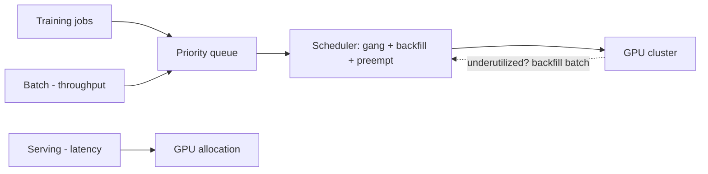

# GPU Clusters & Batch Scheduling

> **Level:** 10 (Extreme-Scale) · **Prerequisites:** [Vector Search & RAG](07-vector-search-rag.md)
> **Navigation:** [← Previous: Vector Search & RAG](07-vector-search-rag.md) · [Next → Data Lakes, Lakehouses & Data Mesh](09-lakehouse-data-mesh.md)

## Learning objectives
- Reason about GPU cluster economics: expensive, scarce, utilization-critical.
- Schedule batch jobs and serve inference with queueing, priorities, and gang scheduling.
- Reason about heterogeneity (training vs inference GPUs) and packing.

## GPU clusters
GPUs are expensive and scarce; **utilization** is the dominant economic metric. The
challenge: keep expensive accelerators busy without starving batch or over-provisioning
serving. This drives sophisticated scheduling, sharing (multi-tenant GPU partitioning),
and mixing latency-sensitive serving with throughput batch.

## Batch scheduling
A **batch scheduler** queues jobs, matches them to resources (gang scheduling for
distributed training that needs all workers simultaneously), respects priorities, and
handles preemption. Backfill packing improves utilization. Checkpointing enables
preemption/resume for long training jobs.

## Gang scheduling
Distributed training needs **all** its workers (or none) — starting some and blocking is
wasteful. **Gang scheduling** allocates a whole group together or waits. Without it, a
cluster deadlocks with partially-started jobs holding GPUs.

## Why this matters
At the scale of modern AI workloads, the cluster is the computer; scheduling quality is the
difference between an efficient and a bankrupt GPU fleet. Utilization, priorities, and
gang scheduling are the core problems.

## Examples
- A training cluster uses backfill to pack small jobs into spare GPUs; long jobs
  checkpoint so they can be preempted for higher-priority work.
- Serving gets GPU reservations for latency; batch fills the gaps.
- A multi-tenant GPU is partitioned so a small inference job and a small training job share
  one device.

## Trade-offs
- **Utilization vs latency**: packing batch tight risks starving serving; reserve for
  latency.
- **Preemption** raises utilization but wastes prior compute (checkpoint to recover).
- **Gang scheduling** avoids deadlock but reduces packing flexibility.

## When NOT to apply
- Don't run latency-sensitive serving unreserveded on a batch-scheduled cluster (it'll be
  preempted).
- Don't gang-block the whole cluster for a huge job (starves everyone).
- Don't ignore utilization — idle GPUs are the largest waste here.

## Common mistakes
- No gang scheduling → deadlock from partial allocations.
- Serving preempted by batch (no priority/reservation).
- Low utilization from no backfill/checkpointing.

## Failure modes and operational concerns
- Deadlock from partial gang allocation.
- A large job monopolizing the cluster.
- Preemption storms wasting compute.

## Review questions
1. Why is utilization the dominant metric for GPU clusters?
2. What problem does gang scheduling solve?
3. How do you mix latency serving and throughput batch on one cluster?
4. Give a deadlock failure and the fix.

## Further reading
MapReduce: S-MAPREDUCE · serving/autoscaling: Level 9 · LLM serving case study.

---
[← Previous: Vector Search & RAG](07-vector-search-rag.md) · [Next → Data Lakes, Lakehouses & Data Mesh](09-lakehouse-data-mesh.md)
