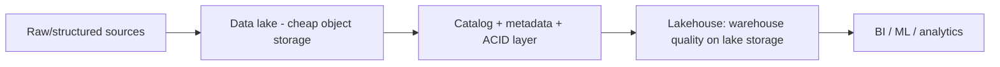

# Data Lakes, Lakehouses & Data Mesh

> **Level:** 10 (Extreme-Scale) · **Prerequisites:** [GPU Clusters & Batch](08-gpu-batch-scheduling.md)
> **Navigation:** [← Previous: GPU Clusters & Batch](08-gpu-batch-scheduling.md) · [Next → Payment Systems, Ledgers & Fraud](10-payment-ledger-systems.md)

## Learning objectives
- Distinguish data warehouse, lake, and lakehouse.
- Reason about the data mesh as an organizational architecture for analytics at scale.
- Reason about schema, governance, and the catalog at PB/EB scale.

## Lakes vs warehouses vs lakehouses
- **Data warehouse**: structured, schema-on-write, SQL, curated; costly to load; great for
  BI.
- **Data lake**: cheap object storage holding raw data in any format (schema-on-read);
  flexible but easily a ""data swamp"" without a catalog/governance.
- **Lakehouse**: lake storage + a metadata/transaction layer (ACID, schema, time travel)
  that gives warehouse-like quality on cheap lake storage — combining flexibility and
  governance.

## Data mesh
A **data mesh** is an *organizational* architecture: treat analytics as a product, owned
by the domain teams that produce the data (each exposes **data products** with contracts),
rather than a central team ingesting everything. It scales ownership and quality but needs
federation (a catalog, governance, and self-serve platform).

## Catalog and governance
At PB/EB scale, **finding** and **trusting** data is the bottleneck. A catalog (lineage,
schema, ownership, quality) and governance (access, retention, PII) are what prevent the
lake becoming a swamp. Schema-on-read is only useful with discoverable, governed schemas.

## Why this matters
The analytics stack at scale is about more than storage: cheap, governed, discoverable,
ACID-quality data, owned by the teams that understand it. Lakehouse + mesh address the
scale problems warehouses and raw lakes each failed on.

## Examples
- A lakehouse stores raw + curated data with ACID and time travel; ML and BI both read it.
- A data mesh: each team publishes governed "data products" with contracts; a central
  catalog makes them discoverable.
- Lineage tracks which dataset fed which model, enabling impact analysis.

## Trade-offs
- **Lakehouse**: warehouse quality + lake cost vs metadata-layer complexity.
- **Mesh**: scales ownership vs federation and self-serve platform investment.
- **Schema-on-read**: flexibility vs governance burden (needs a catalog).

## When NOT to apply
- Don't build a data mesh before you have the org to own domains (mesh needs owners).
- Don't keep raw data in a lake with no catalog/governance (swamp).
- Don't over-engineer a lakehouse for a few GB (a warehouse suffices).

## Common mistakes
- A lake with no catalog → a swamp no one trusts.
- A central team ingesting everything (mesh solves this but needs ownership).
- Treating governance as optional at scale (it's the core).

## Failure modes and operational concerns
- Metadata-layer failures breaking query correctness.
- Unowned datasets with no quality/contract (rot).
- Lineage gaps preventing impact analysis.

## Review questions
1. What does a lakehouse add to a lake?
2. How does a data mesh change ownership of analytics?
3. Why does a catalog matter at PB scale?
4. Give a "data swamp" failure and the fix.

## Further reading
Bigtable: S-BIGTABLE · Spanner: S-SPANNER · recommendations: next chapters.

---
[← Previous: GPU Clusters & Batch](08-gpu-batch-scheduling.md) · [Next → Payment Systems, Ledgers & Fraud](10-payment-ledger-systems.md)
