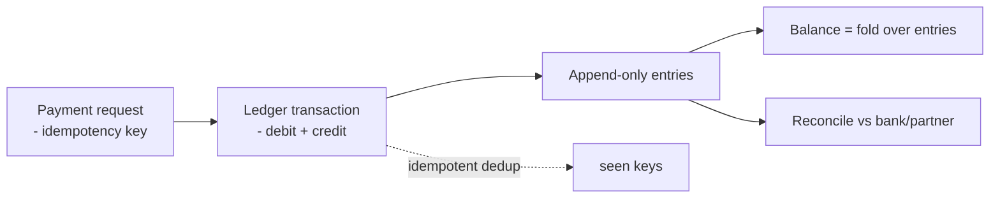

# Payment Systems, Financial Ledgers & Fraud Detection

> **Level:** 10 (Extreme-Scale) · **Prerequisites:** [Lakehouse & Data Mesh](09-lakehouse-data-mesh.md)
> **Navigation:** [← Previous: Lakehouse & Data Mesh](09-lakehouse-data-mesh.md) · [Next → Identity, IoT, P2P & Blockchain](11-identity-iot-p2p-blockchain.md)

## Learning objectives
- Design a financial ledger with strong, durable, double-entry correctness.
- Reason about idempotency, exactly-once money movement, and reconciliation.
- Build real-time fraud detection as a stream + model pipeline.

## The ledger
A financial **ledger** is an append-only record of immutable entries; balances are derived
  by **folding** entries (event-sourcing, Level 5). Correctness requires: **double-entry**
  (every move debits one account and credits another, always balanced), **idempotency**
  (a retried payment never moves money twice), and **durability** (a committed entry is
  never lost — synchronous replication).

## Money movement semantics
- **Idempotency keys** on every payment; a retry returns the original result, never a
  duplicate move.
- **Effectively-once**: at-least-once delivery + idempotent application (Level 4). A
  ledger is the canonical place this matters — a double charge is a real-money error.
- **Reconciliation**: periodically compare internal ledger to external bank/partner
  statements; mismatches are incidents. Build reconciliation in from day one.

## Fraud detection
Fraud is a **real-time stream + model** pipeline (Level 10): score each event in
milliseconds, block/alert high-risk, and learn from outcomes. Latency matters (decisions
must precede settlement) and false-positive cost is real (blocking a good transaction).

## Why this matters
Money systems fail expensively and publicly. The disciplines — immutable ledger,
idempotency, synchronous durability, reconciliation — are non-negotiable; skipping any one
becomes a headline. Fraud detection is where stream/ML (this level) meets money.

## Examples
- A payment uses an idempotency key; the ledger records a balanced debit/credit; a retry is
  a no-op.
- A nightly job reconciles the internal ledger to the partner bank; a mismatch pages the
  team.
- A fraud stream scores each transaction in <200 ms; high-risk ones are held for review.

## Trade-offs
- **Strong/durable ledger**: correctness vs write latency (synchronous replication).
- **Block-on-fraud**: safety vs customer friction (tune the false-positive rate).
- **Append-only ledger**: auditability + replay vs no in-place edits (corrections are new
  entries).

## When NOT to apply
- Don't update balances in place (mutable state loses audit); derive from entries.
- Don't move money without an idempotency key (double charges).
- Don't ship a ledger with no reconciliation (you'll find mismatches in a crisis).

## Common mistakes
- Mutable balances (no audit trail, race conditions).
- Non-idempotent money movement (double charges on retry).
- No reconciliation → silent drift vs partners.

## Failure modes and operational concerns
- A double-charge from non-idempotent retries (the classic money bug).
- Unreconciled drift vs a partner bank.
- A fraud model blocking good transactions at scale (customer harm).

## Review questions
1. Why is a ledger append-only with derived balances?
2. How do you prevent a double charge?
3. Why reconcile, and against what?
4. Give a fraud false-positive failure and its cost.

## Further reading
Event sourcing: Level 5 · idempotency: Level 4 · streams: this level.

---
[← Previous: Lakehouse & Data Mesh](09-lakehouse-data-mesh.md) · [Next → Identity, IoT, P2P & Blockchain](11-identity-iot-p2p-blockchain.md)
