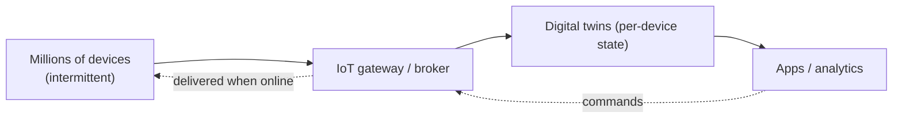

# Internet-Scale Identity, IoT/Digital Twins, P2P & Blockchain

> **Level:** 10 (Extreme-Scale) · **Prerequisites:** [Payment/Ledger/Fraud](10-payment-ledger-systems.md)
> **Navigation:** [← Previous: Payment/Ledger/Fraud](10-payment-ledger-systems.md) · [Next → (end of Level 10)]

## Learning objectives
- Reason about internet-scale identity (federated, decentralized).
- Design for IoT/digital-twin scale (millions of devices, intermittent connectivity).
- Compare P2P and blockchain trust models and when each fits.

## Internet-scale identity
At internet scale, identity is **federated** (OIDC/SAML, Level 7) and increasingly
**decentralized** (user-held credentials). The challenges: SSO across many providers,
revocation at scale, and privacy (minimize correlation). Identity is the root of authZ
(Level 7), so its availability and integrity are foundational.

## IoT & digital twins
IoT means **millions of devices**, often with intermittent connectivity, low power, and
constrained protocols. Patterns:
- **Ingest at the edge**, batch-sync when connected (intermittently connected systems).
- **Per-device state** (a "digital twin") updated by telemetry; queries fan out to
  millions of twins.
- **Bidirectional command** to devices with acknowledged delivery.

## P2P & blockchain
- **Peer-to-peer (P2P)**: peers serve each other (chunks, presence), cutting central
  egress/latency; trust is via replication and content addressing. Good for massively
  distributed delivery where a central origin can't keep up.
- **Blockchain**: a tamper-evident, decentralized ledger via consensus (often BFT,
  Level 4). Use it where *mutually distrustful* parties must agree (cross-org settlement,
  provenance). It is slow and expensive; don't use it where a trusted central party or a
  regular distributed DB suffices.

## Why this matters
These are the architectural edges: identity at the root of trust, IoT at the scale of
billions of constrained devices, and P2P/blockchain for trustless distribution. Each is a
niche where the usual centralized, request/response assumptions break.

## Examples
- A device fleet syncs telemetry when online; digital twins hold current state; commands
  queue and deliver on reconnect.
- A federated identity provider supports SSO across many partners with revocation at scale.
- A P2P CDN distributes content via peers; a blockchain settles cross-org transactions
  where parties don't trust a central operator.

## Trade-offs
- **Federated identity**: scale/SSO vs correlation/privacy and provider trust.
- **IoT edge-sync**: scale/intermittent connectivity vs consistency and command latency.
- **Blockchain**: trustless agreement vs throughput, cost, and energy; P2P vs a central
  origin's egress/availability.

## When NOT to apply
- Don't use a blockchain where a central trusted party or a normal DB works (huge overhead).
- Don't assume IoT devices are always online (design for intermittent connectivity).
- Don't centralize identity correlation if privacy is a requirement.

## Common mistakes
- Blockchain for a problem that doesn't need trustless agreement.
- Treating IoT devices as always-connected, reliable clients.
- P2P delivery with no fallback when peers vanish.

## Failure modes and operational concerns
- Device fleet storms on reconnect (thundering herd — stagger reconnects).
- Identity provider outage breaking SSO across many apps.
- Blockchain throughput limits for a high-volume workload.

## Review questions
1. Why is IoT designed for intermittent connectivity?
2. When does a blockchain earn its cost over a central DB?
3. What problem does P2P delivery solve for an origin?
4. Give an IoT reconnect-storm failure and a mitigation.

## Further reading
OAuth/OIDC: Level 7 · BFT/consensus: Level 4 · edge: this level.

---
[← Previous: Payment/Ledger/Fraud](10-payment-ledger-systems.md) · Next → (end of Level 10)
