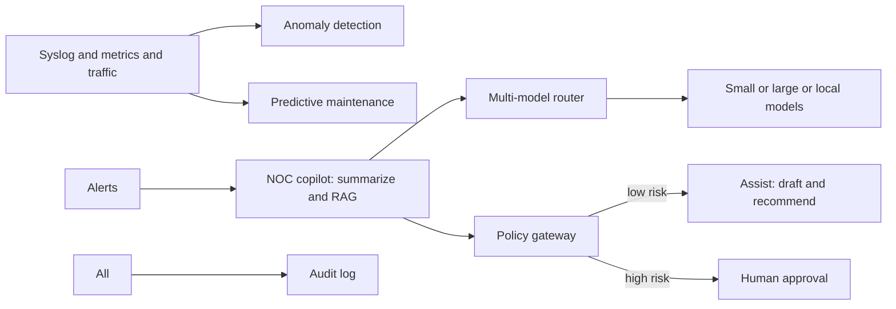

# AI for Network Operations

> **Prev:** Firmware Upgrade Lifecycle | **Next:** (end of Network and AI Operations)

## Learning objectives

After this chapter you can explain how AI assists network operations (anomaly detection, predictive maintenance, NOC copilots, runbook RAG, incident summarization) while humans approve high-risk actions.

## Overview

AI for network operations applies machine learning and LLMs to network data (syslog, metrics, traffic) to detect anomalies, predict failures, summarize incidents, retrieve relevant runbooks, and recommend remediation. The critical design principle: AI assists, humans approve. AI never auto-executes high-risk actions (firmware upgrades, routing changes, firewall changes, device reboots). Deterministic systems and human approval gates control operational changes.

## How it works

Anomaly detection models learn normal patterns (traffic baselines, device metric distributions) and flag deviations. Predictive maintenance forecasts failures from trends (CPU rising, interface errors increasing). A NOC copilot (LLM) summarizes active incidents, retrieves runbooks via RAG, drafts changes (not executes), and guides engineers. Multi-model routing sends classification to small models, analysis to large models, confidential configs to local models. A policy gateway intercepts every action; high-risk routes to human approval.

## Architecture

## Trade-offs

AI assist (speed, insight) vs human approval (safety). Multi-model routing (cost, quality) vs single model (simple). Anomaly detection (proactive) vs threshold alerts (simple, reactive). Local model (privacy) vs external (quality).

## When NOT to use this

See trade-offs above; do not apply a pattern where a simpler approach suffices.

## Common mistakes

Trusting AI output without verification; no policy gateway (auto-execute risk); anomaly model false positives (alert fatigue); no RAG permission filtering; sending confidential configs to external models.

## Failure modes

AI hallucinates a remediation; anomaly model misses a novel failure; policy gateway down with fail-open; RAG returns an unauthorized runbook; cost runaway from uncapped LLM calls.

## Review questions

1. What is the core principle of AI for network operations? 2. What does a NOC copilot do and not do? 3. Why use multi-model routing? 4. What must the policy gateway do on failure? 5. When is a local model preferred over an external one?

## Further reading

AI Systems track: docs/ai-systems/; intelligent syslog monitoring case study; AI-assisted NOC case study; secure network agent case study; AI safety gateway: docs/ai-systems/09-ai-security.md

---
Prev: Firmware Upgrade Lifecycle | Next: (end of Network and AI Operations)
