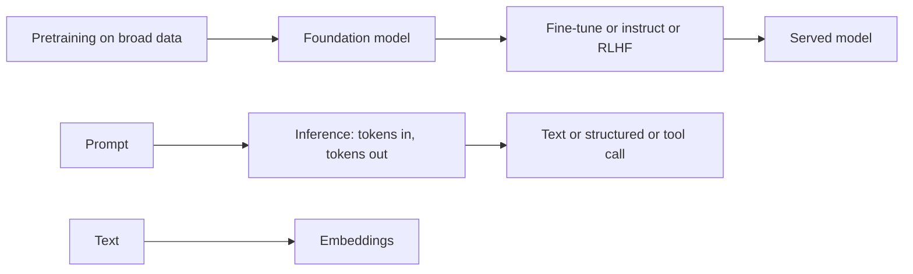

# AI and ML Fundamentals

> **Track:** AI Systems · **Prev:** AI track start · **Next:** AI Hardware

## Learning objectives

After this chapter you can define AI, ML, deep learning, and generative AI; explain foundation models and LLMs; distinguish tokens, embeddings, and context windows; and contrast inference with training.

## Overview

Artificial intelligence is software that performs tasks we associate with human intelligence. Machine learning (ML) is AI learned from data rather than hand-coded. Deep learning is ML using neural networks with many layers. Generative AI produces new content (text, images, code) rather than only classifying inputs. A foundation model is a large model pretrained on broad data and then adapted to many tasks. A large language model (LLM) is a foundation model trained to predict the next token in text, and is the backbone of most current generative-AI systems.

## How it works

Tokens are the units an LLM reads and writes; tokenization splits text into these units. Embeddings are numeric vectors representing the meaning of text; similarity between embeddings approximates semantic similarity. The context window is how many tokens a model can attend to in one call. Inference is running a trained model to produce output; training (pretraining, then fine-tuning, instruction tuning, and RLHF) builds the model weights. Sampling knobs (temperature, top-k, top-p) trade determinism for diversity. Structured output forces JSON/typed schemas; tool/function calling lets the model invoke external capabilities; multimodal models accept more than text.

## Architecture

## Capacity considerations

Inference cost scales with input and output tokens, not requests. A 20-token and a 100,000-token request differ by ~5,000x in compute and money, so request-per-second limits are insufficient; plan by tokens/s and the context length distribution.

## Latency considerations

Measure time to first token (TTFT), time per output token (TPOT), and tokens per second. TTFT depends on prefill (processing the prompt); TPOT on decode. Long prompts inflate TTFT; long outputs inflate total latency.

## Cost considerations

Dominant costs are GPU-seconds for serving and per-token model API charges. Cache common prompts; right-size the model; route cheap tasks to small models.

## Security and privacy risks

Prompts and outputs can leak or be injected; models hallucinate; do not trust structured output without validation; never put secrets in prompts sent to unapproved external models.

## Evaluation methodology

Evaluate with task-specific suites (accuracy, groundedness, refusal rate, latency, cost) and regression tests; do not rely on vibes.

## Scaling strategy

Serve many tenants with per-tenant quotas and routing; scale by adding replicas or bigger GPUs; cap context length to bound latency.

## Trade-offs

Bigger models (quality) vs cost/latency. High temperature (diversity) vs determinism. Long context (recall) vs latency/cost.

## When NOT to use this

Do not use an LLM for exact computation, real-time control, or anything requiring guaranteed correctness without verification. Do not choose generative AI where a deterministic classifier or rule suffices.

## Common mistakes

Treating LLM output as reliable facts; ignoring token-based cost; over-long contexts; no prompt/eval versioning.

## Failure modes

Hallucination; prompt injection; context overflow; token-rate exhaustion; silent schema violations from structured output.

## Practical exercise

Estimate the per-day cost of 1M requests averaging 500 input + 200 output tokens at a given per-1M-token price; then recompute if 10 percent have 100k-token contexts.

## Interview questions

What is the difference between training and inference? Why is token-based capacity planning different from RPS? What does the context window cost you?

## Further reading

Generative AI overview; model documentation; S-RAG for RAG; S-VECTORDB for vectors.

---
Prev: AI track start · Next: AI Hardware
