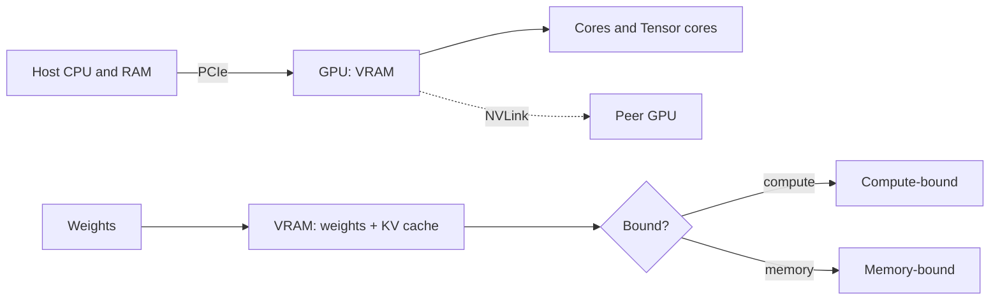

# AI Hardware

> **Track:** AI Systems · **Prev:** AI and ML Fundamentals · **Next:** AI Capacity Planning

## Learning objectives

After this chapter you can describe CPU, GPU, and TPU roles in inference; reason about VRAM, bandwidth, and memory- vs compute-bound workloads; and explain quantization and its trade-offs.

## Overview

Inference hardware determines what you can serve and at what latency/cost. CPUs run inference but are slow for matrix math. GPUs parallelize matrix multiply across thousands of cores and are the workhorse of LLM serving; tensor cores accelerate low-precision matmul. TPUs are custom accelerators optimized for tensor workloads. The binding constraint is often memory, not compute: a model must fit in VRAM (model weights + KV cache), and moving data between host and device (PCIe) or between GPUs (NVLink) is expensive.

## How it works

A model is loaded into GPU VRAM as weights. Each forward pass does matmuls (compute) and reads weights/KV (memory). Workloads are compute-bound (matmul-heavy) or memory-bound (stalled reading weights). Quantization reduces precision (FP32 to FP16/BF16 to INT8 to INT4) to fit bigger models and move less data, at some quality loss. Multi-GPU inference shards a model across GPUs (tensor or pipeline parallel) or serves replicas.

## Architecture

## Capacity considerations

Capacity = how many concurrent requests fit given VRAM for weights + KV cache, and the compute to serve them at target tokens/s. Offloading to host RAM helps fit large models but is slow; quantization trades quality for capacity.

## Latency considerations

Memory-bound decode limits TPOT; prefill (TTFT) is compute-bound on long prompts. PCIe/NVLink transfers add latency for multi-GPU sharding.

## Cost considerations

GPUs are the dominant cost; utilization is the lever. Quantization and batching raise tokens/s/GPU; right-size to keep GPUs busy without starving latency.

## Security and privacy risks

Side channels and model-weight theft are concerns; isolate tenants; protect weights as IP.

## Evaluation methodology

Benchmark real shapes (your prompt length distribution), not vendor marketing; report date, hardware, and model version with every number.

## Scaling strategy

Scale by adding GPUs/replicas; multi-GPU for large models; autoscale on tokens/s and queue depth; batch for utilization.

## Trade-offs

Precision (quality) vs VRAM/throughput. Big model single-GPU vs sharded. Batching (throughput) vs latency.

## When NOT to use this

Do not quantize below what your quality eval tolerates; do not offload to host RAM for latency-critical paths; do not assume vendor benchmarks generalize.

## Common mistakes

Ignoring VRAM for KV cache; treating GPUs as infinitely scalable; over-quantizing without eval; no multi-tenancy isolation.

## Failure modes

OOM when context exceeds VRAM; PCIe bottleneck on offload; straggler GPU in pipeline parallel; underutilization from no batching.

## Practical exercise

Given a model of N billion parameters at INT8 and a GPU with V GB VRAM, compute how many concurrent contexts of L tokens fit (weights + KV cache).

## Interview questions

Why is inference often memory-bound? What does quantization buy and cost? When would you shard a model across GPUs?

## Further reading

GPU/TPU architecture references; quantization papers; vendor docs (dated).

---
Prev: AI and ML Fundamentals · Next: AI Capacity Planning
