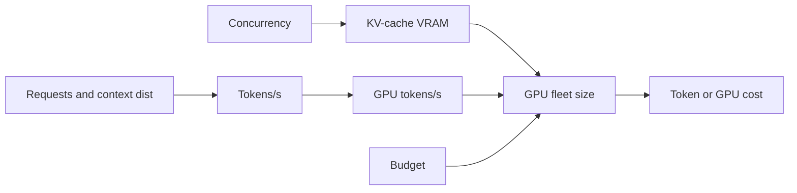

# AI Capacity Planning

> **Track:** AI Systems · **Prev:** AI Hardware · **Next:** Vector Databases

## Learning objectives

After this chapter you can plan AI capacity by tokens rather than requests, size GPU fleets, and reason about KV-cache and cost budgets.

## Overview

AI capacity planning is different from traditional services: load is measured in tokens, not requests, because a request with a 100k-token context costs thousands of times more than a 20-token one. You plan for tokens/s, the context-length distribution, the KV-cache memory each concurrent request consumes, and the GPU fleet needed to serve it at target TTFT/TPOT within a cost budget.

## How it works

Estimate requests/s, average and peak input/output tokens, and the tail of context length. Convert to tokens/s. Each concurrent request reserves KV-cache memory proportional to its context; the number that fit in VRAM bounds concurrency. Match that to GPU throughput (tokens/s/GPU) for compute, then size the fleet and the cost (tokens x price, or GPU-seconds).

## Architecture

## Capacity considerations

Two limits: KV-cache VRAM (concurrency) and GPU compute (tokens/s). Either can bind; plan for both and for the context-length tail, not the average.

## Latency considerations

TTFT bounded by prefill compute; TPOT by decode (memory-bound). Batching raises throughput but adds per-request latency; cap batch for the latency SLO.

## Cost considerations

Per-token price (external) or GPU-seconds (self-host). Cache, route to smaller models, and cap context to control cost. Set per-tenant token budgets.

## Security and privacy risks

Per-tenant quotas prevent one tenant from starving others; audit token usage; do not log full prompts with PII.

## Evaluation methodology

Track tokens/s, TTFT/TPOT, GPU utilization, cost per request, and budget burn; alert on the tail and on cost.

## Scaling strategy

Add GPUs/replicas; multi-LoRA to serve many fine-tunes on one fleet; autoscale on tokens/s and queue depth.

## Trade-offs

Batching (throughput) vs latency. Big model (quality) vs cost. Long context (recall) vs KV-cache memory and cost.

## When NOT to use this

Do not plan by RPS alone; do not size by average context (the tail melts you); do not forget KV-cache memory.

## Common mistakes

RPS-only planning; ignoring context-length tail; no per-tenant budgets; underprovisioning KV-cache.

## Failure modes

VRAM exhaustion on long contexts; latency collapse from over-batching; cost runaway from uncapped long contexts.

## Practical exercise

Given 100 req/s, mean 1k input / 200 output tokens, 5 percent at 50k input, compute tokens/s and the GPU count at 6k tokens/s/GPU; then recompute cost at a per-1M-token price.

## Interview questions

Why is RPS the wrong unit for LLMs? What bounds concurrency? How do you cost a workload with a long-context tail?

## Further reading

AI hardware chapter; inference-engine docs; S-RAG for context costs.

---
Prev: AI Hardware · Next: Vector Databases
