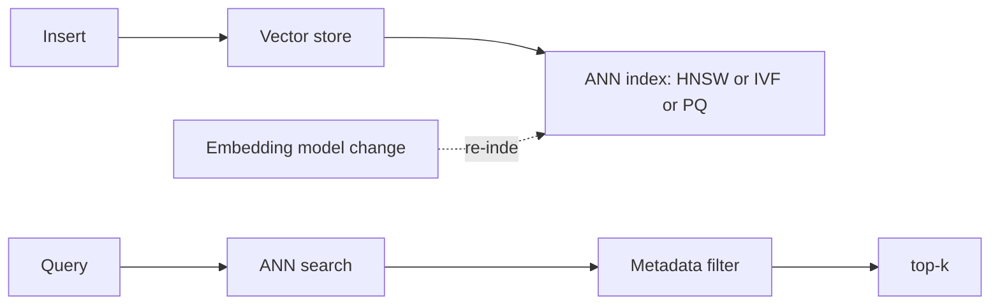

# Vector Databases

> **Track:** AI Systems · **Prev:** AI Capacity Planning · **Next:** Chunking and Ingestion

## Learning objectives

After this chapter you can choose an ANN index and similarity metric, reason about recall/latency/memory, and design sharding, re-indexing, and multi-tenancy.

## Overview

A vector database stores embeddings and answers similarity queries. Exact nearest-neighbor search is intractable at scale, so systems use approximate nearest-neighbor (ANN) indexes (HNSW, IVF-Flat, IVF-PQ) that trade recall for speed. Hybrid retrieval combines dense vectors with sparse (keyword) signals and metadata filters.

## How it works

Vectors are inserted with metadata; an index is built for fast ANN. Queries embed, retrieve top-k, apply metadata filters, and return. HNSW is a graph index (fast, memory-heavy); IVF partitions by clusters; product quantization (PQ) compresses vectors to save memory at recall cost. Similarity is cosine, dot-product, or Euclidean. Sharding scales the index; re-indexing is needed when the embedding model changes.

## Architecture

## Capacity considerations

Index memory dominates; PQ/quantization and sharding scale it. Hot/cold tiers cut cost for rarely queried vectors.

## Latency considerations

ANN p99 < 100 ms at billion scale with sharding + fan-out merge; metadata filters add cost.

## Cost considerations

Memory (index) is the cost lever; tier cold vectors; tune recall vs memory; shard to scale.

## Security and privacy risks

Per-tenant namespace isolation; metadata may contain PII (redact); do not leak embeddings across tenants.

## Evaluation methodology

Measure recall@k, query latency, index build time, memory; recall tuning trades against latency and cost.

## Scaling strategy

Shard by partition; fan-out search + merge top-k; replicate for availability; multi-tenant namespaces.

## Trade-offs

ANN speed vs recall. In-memory (latency) vs cost. Incremental update (freshness) vs rebuild (recall). Sharding (scale) vs fan-out latency.

## When NOT to use this

Do not use vector search for exact keyword matching (use an inverted index); do not over-tune recall without measuring; do not ignore embedding-model version drift.

## Common mistakes

ANN tuned for speed so recall drops; embedding-version drift; high-cardinality metadata filters; no multi-tenant isolation.

## Failure modes

Hot shard skew; index rebuild cost; stale results from index lag; cross-tenant leakage.

## Practical exercise

Pick an index and shard count for 1B 768-d vectors with metadata filters, and compute memory at FP16 and at PQ.

## Interview questions

When is ANN the wrong choice? How do you handle an embedding-model change? How does hybrid retrieval help?

## Further reading

S-VECTORDB; ANN/HNSW/IVF/PQ references.

---
Prev: AI Capacity Planning · Next: Chunking and Ingestion
