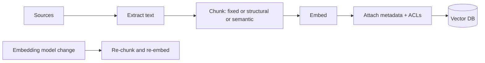

# Chunking and Ingestion

> **Track:** AI Systems · **Prev:** Vector Databases · **Next:** Hybrid Search and Reranking

## Learning objectives

After this chapter you can choose chunking strategies, build an ingestion pipeline, and reason about metadata and embedding-model versioning.

## Overview

Retrieval quality is gated by how documents are chunked and ingested. A chunk is the unit of retrieval; too large dilutes relevance, too small loses context. The ingestion pipeline extracts text, chunks, embeds, attaches metadata, and writes to the vector store, versioned to the embedding model.

## How it works

Extract text from sources; chunk by fixed size with overlap, by structure (headings, sentences, paragraphs), or by semantics; embed each chunk; attach metadata (source, section, ACLs, version); write to the vector DB with a schema. Re-chunk and re-embed on model change; version embeddings to query the right index.

## Architecture

## Capacity considerations

Chunk count drives storage and index memory; chunk size drives embedding cost and retrieval relevance.

## Latency considerations

Ingestion is batch/stream; query latency depends on chunk count and index, not chunking directly.

## Cost considerations

Embedding calls (compute) + vector storage. Right-size chunks; embed once; dedup near-duplicates.

## Security and privacy risks

ACLs and tenant attached as metadata; redact PII before embedding; do not embed secrets.

## Evaluation methodology

Measure retrieval recall and answer groundedness for different chunk sizes; chunking affects end-to-end RAG quality more than the model sometimes.

## Scaling strategy

Parallel ingestion workers; batch embed; idempotent ingestion; re-index on model change.

## Trade-offs

Chunk size (relevance vs context) vs count (cost/recall). Overlap (no boundary loss) vs dedup. Structural (quality) vs fixed (simple).

## When NOT to use this

Do not use tiny chunks for questions needing broad context; do not over-lap into duplication; do not ignore metadata/ACLs.

## Common mistakes

Fixed chunks cutting sentences; no overlap; no metadata/ACLs; embedding-model drift; re-embedding everything on every change.

## Failure modes

Bad chunks => poor retrieval; ACL leakage via metadata; ingestion backlog; model-version mismatch.

## Practical exercise

Compare retrieval quality for 256-token fixed chunks vs structural chunking on a sample corpus; measure recall.

## Interview questions

How does chunk size affect RAG quality? How do you handle an embedding-model change safely? Why attach ACLs as metadata?

## Further reading

S-RAG; chunking references; S-VECTORDB.

---
Prev: Vector Databases · Next: Hybrid Search and Reranking
