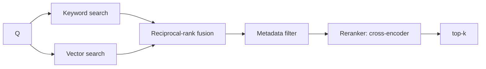

# Hybrid Search and Reranking

> **Track:** AI Systems · **Prev:** Chunking and Ingestion · **Next:** Basic RAG

## Learning objectives

After this chapter you can combine keyword and vector search, apply reranking, and reason about metadata filtering and fusion.

## Overview

Dense vector search captures semantic similarity but misses exact terms; keyword (sparse) search catches exact terms but misses paraphrase. Hybrid search combines both, then a reranker (a cross-encoder) re-scores the merged candidates for relevance. Metadata filtering narrows the candidate set (by ACL, source, date).

## How it works

Run BM25/keyword and vector search in parallel; fuse (e.g., reciprocal-rank fusion); apply metadata filters before or after; pass the top-N to a reranker that scores each candidate against the query; return the top-k. Rerankers are more accurate than vector similarity but slower, so apply them to a shortlist.

## Architecture

## Capacity considerations

Two indexes (keyword + vector) plus a reranker; reranker compute is the added cost.

## Latency considerations

Parallel search + rerank adds a stage; keep the shortlist small to bound rerank latency.

## Cost considerations

Reranker inference per candidate; fuse cheaply; cache common queries.

## Security and privacy risks

Metadata/ACL filters enforced so a user cannot retrieve unauthorized chunks; tenant isolation.

## Evaluation methodology

Measure recall@k and nDCG with and without reranking; rerankers usually lift precision at latency cost.

## Scaling strategy

Shard both indexes; fan-out + merge; reranker scaled by shortlist rate.

## Trade-offs

Vector (semantic) vs keyword (exact) -> hybrid. Rerank (precision) vs latency/cost. Pre-filter (fast, recall risk) vs post-filter (slower, accurate).

## When NOT to use this

Do not always rerank (cost/latency) when vector recall is already high; do not skip metadata filters (security); do not fuse without normalization.

## Common mistakes

Fusing raw scores across systems without normalization; no metadata/ACL enforcement; reranking too many candidates; keyword index absent.

## Failure modes

Filter bypass; reranker bottleneck; fusion dominated by one system; tenant leakage.

## Practical exercise

Measure nDCG for vector-only vs hybrid vs hybrid+rerank on a labeled set; report the latency/cost trade.

## Interview questions

Why combine keyword and vector search? What does a reranker buy and cost? How do you enforce access control in retrieval?

## Further reading

S-VECTORDB; hybrid/reranking references; S-RAG.

---
Prev: Chunking and Ingestion · Next: Basic RAG
