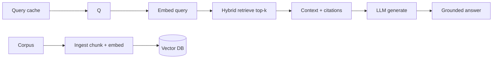

# Basic RAG

> **Track:** AI Systems · **Prev:** Hybrid Search and Reranking · **Next:** Advanced RAG (planned)

## Learning objectives

After this chapter you can build a retrieve-then-generate RAG pipeline, ground answers with citations, and evaluate groundedness.

## Overview

Retrieval-augmented generation (RAG) grounds an LLM answer in retrieved context, reducing hallucination and enabling private/up-to-date knowledge. Basic RAG: embed the query, retrieve top-k relevant chunks, assemble context, prompt the LLM to answer with citations.

## How it works

Ingest chunks+embeddings ahead of time. At query time: embed the query; hybrid search + rerank top-k; assemble context with source metadata; prompt the LLM to answer using only the context and cite sources; stream the answer; cache common queries.

## Architecture

## Capacity considerations

Vector index (memory) + LLM generation (compute) dominate; caching and retrieval filtering cut LLM calls.

## Latency considerations

Retrieval + generation; cache common queries; keep top-k small; stream tokens.

## Cost considerations

LLM calls dominate; cache aggressively; route to smaller models when grounding is simple.

## Security and privacy risks

Per-tenant corpus isolation; do not ground on unauthorized chunks; redact PII; audit queries; permission-aware retrieval.

## Evaluation methodology

Evaluate retrieval (recall/precision) and generation (groundedness, answer correctness, citation accuracy) separately and end-to-end; watch hallucination rate.

## Scaling strategy

Shard the index; multi-tenant namespaces; cache; regional retrieval; canary model changes.

## Trade-offs

Retrieval depth (grounding) vs latency/cost. Strict grounding (fewer hallucinations) vs answer coverage. Cache (cost) vs freshness.

## When NOT to use this

Do not build RAG where a deterministic lookup suffices; do not skip grounding evaluation; do not let the model answer beyond the context without a disclaimer.

## Common mistakes

Low-recall retrieval making RAG miss context; no citations; cache staleness on corpus/model change; no permission-aware retrieval.

## Failure modes

Stale cache returning old answers; retrieval missing the right chunk; model answering beyond context; cross-tenant grounding.

## Practical exercise

Build basic RAG; measure groundedness with and without citations; re-embed on a model change with zero downtime.

## Interview questions

What does RAG reduce? How do you cite reliably? What breaks if you change embedding models? How do you fail when retrieval is empty?

## Further reading

S-RAG; S-VECTORDB; hybrid search chapter; LLM-inference case study.

---
Prev: Hybrid Search and Reranking · Next: Advanced RAG (planned)
