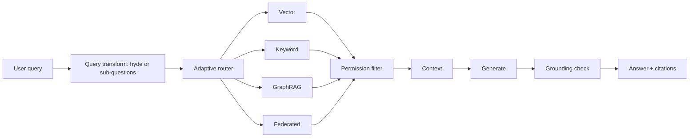

# Advanced RAG

> **Track:** AI Systems · **Prev:** Basic RAG · **Next:** Agentic Systems

## Learning objectives

After this chapter you can apply query transformation, adaptive retrieval, GraphRAG, federated retrieval, permission-aware retrieval, and grounding/verification to improve RAG beyond the basic pipeline.

## Overview

Basic RAG retrieves chunks and generates. Advanced RAG transforms the query before retrieval, adapts retrieval strategy to the question type, uses graph-structured knowledge (GraphRAG), federates across multiple sources, enforces per-document permissions in retrieval, and verifies that the generated answer is grounded in the retrieved context.

## How it works

Query transformation rewrites the user question for retrieval (hyde, multi-query, sub-question decomposition). Adaptive retrieval picks the strategy (vector, keyword, graph, or mixed) per query type. GraphRAG retrieves from a knowledge graph for multi-hop reasoning. Federated retrieval queries multiple corpora and merges. Permission-aware retrieval filters candidates by the user ACLs BEFORE generation, so the model never sees unauthorized context. Grounding verification checks that each claim in the answer cites a retrieved chunk.

## Architecture

## Capacity considerations

Multiple retrieval passes increase compute; graph traversal adds latency; permission filtering adds overhead per candidate. Right-size the depth per query type.

## Latency considerations

Query transform adds an LLM call; graph retrieval is slower than vector; federation fans out. Cache transformed queries; parallelize where possible.

## Cost considerations

Extra LLM calls for query transform and grounding check; graph retrieval compute. Route simple queries to basic RAG to save cost.

## Security and privacy risks

Permission-aware retrieval is the critical control: filter candidates by ACL before the model sees them. Federated retrieval must respect each source ACLs. Never let the model generate from unauthorized context.

## Evaluation methodology

Evaluate retrieval (recall, precision, ACL correctness) and generation (groundedness, citation accuracy, hallucination) separately. GraphRAG: measure multi-hop answer accuracy.

## Scaling strategy

Shard all indexes; cache transformed queries; graph store sharded by subgraph; federate with per-source rate limits.

## Trade-offs

Depth (quality) vs latency/cost. Graph (multi-hop) vs vector (semantic). Federated (breadth) vs single (depth). Permission pre-filter (safe) vs post-filter (fast, leaks).

## When NOT to use this

Do not add GraphRAG for single-hop questions; do not federate when one source suffices; do not skip permission filtering; do not skip grounding verification for high-stakes answers.

## Common mistakes

Skipping permission filtering (cross-tenant leakage); no grounding check (hallucination); over-federating (latency); query transform adding latency without quality gain.

## Failure modes

Permission filter bypass; graph traversal timeout; federated source unavailable; grounding check false negative (missed hallucination).

## Practical exercise

Build permission-aware RAG: retrieve top-20, filter by ACL, pass only authorized chunks to the LLM. Measure retrieval recall before and after filtering.

## Interview questions

What is permission-aware retrieval and why does it filter BEFORE generation? How does GraphRAG differ from vector RAG? What does query transformation buy and cost?

## Further reading

S-RAG; S-VECTORDB; GraphRAG papers; permission-aware retrieval references.

---
Prev: Basic RAG · Next: Agentic Systems
