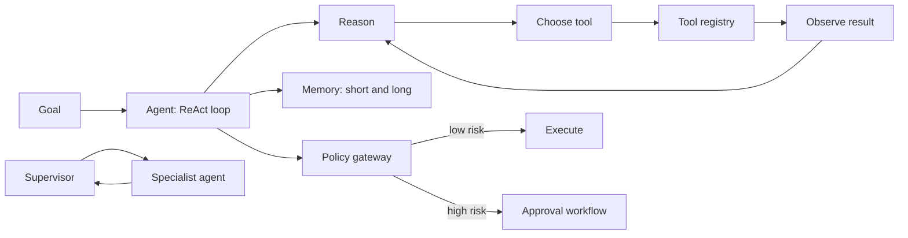

# Agentic Systems

> **Track:** AI Systems · **Prev:** Advanced RAG · **Next:** AI Security

## Learning objectives

After this chapter you can design tool-calling agents with workflow state, memory, ReAct reasoning, planner-executor patterns, multi-agent coordination, and human-approval gates for high-risk actions.

## Overview

An LLM agent uses a model to decide which tools to call, in what order, to accomplish a goal. Unlike a single LLM call, an agent maintains state across steps, uses memory to recall context, and can coordinate with other agents. The core patterns are ReAct (reason-act-observe loop), planner-executor (plan steps then execute), and multi-agent (specialized agents coordinated by a supervisor). High-risk actions require human approval.

## How it works

The agent receives a goal. It reasons about what to do (ReAct: think about the question, decide an action, observe the result, repeat). It calls tools (functions with typed schemas). It maintains state (steps taken, results, pending actions). It uses memory (short-term: current session; long-term: vector DB of prior interactions). A planner breaks complex goals into steps; an executor runs them. Multi-agent systems have specialized agents (research, code, review) coordinated by a supervisor. A policy gateway intercepts every action; high-risk actions route to a human approval workflow.

## Architecture

## Capacity considerations

Each agent step is an LLM call; multi-agent multiplies calls. Token budgets per agent; cache tool results; route planning to cheaper models.

## Latency considerations

Multi-step agents are slower than single calls (N round trips). Stream intermediate results; parallelize independent steps.

## Cost considerations

Token cost scales with steps and context growth (each step adds observations). Cap steps; summarize memory; route cheap reasoning to small models.

## Security and privacy risks

Prompt injection via tool results; tool access must be risk-tiered; policy gateway fail-closed; no agent executes high-risk actions without approval; full audit.

## Evaluation methodology

Evaluate task completion rate, tool-call accuracy, step efficiency, approval rate, and unauthorized-action attempts (must be 0).

## Scaling strategy

Stateless agents behind a gateway; externalize state; shard by session; supervisor coordinates rate-limited specialists.

## Trade-offs

Autonomy (speed) vs approval (safety). Multi-agent (specialization) vs single (simplicity). Long memory (context) vs cost. ReAct (flexible) vs planner-executor (structured).

## When NOT to use this

Do not use an agent for a single deterministic call; do not give an agent tools it should not have; do not skip the policy gateway; do not let agents execute irreversible actions autonomously.

## Common mistakes

Unguarded tool execution; unbounded steps (cost spiral); no memory management (context overflow); no approval gate (unsafe actions); no audit (no accountability).

## Failure modes

Agent loops forever; tool returns malformed data; policy gateway down (fail-closed blocks all); prompt injection via tool output; supervisor deadlock.

## Practical exercise

Design a 3-agent system (research, code, review) with a supervisor. Add a policy gateway that routes code-execution to approval. Show the ReAct loop for one step.

## Interview questions

What is ReAct and how does it differ from a planner-executor? Why must a policy gateway be fail-closed? How do you bound agent cost?

## Further reading

ReAct paper; tool-calling docs; agent frameworks; AI safety gateway references.

---
Prev: Advanced RAG · Next: AI Security
