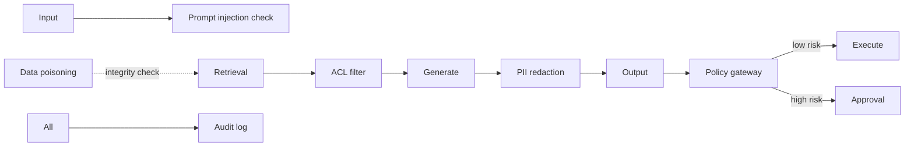

# AI Security

> **Track:** AI Systems · **Prev:** Agentic Systems · **Next:** AI Evaluation

## Learning objectives

After this chapter you can identify and mitigate AI-specific security risks: prompt injection, data poisoning, RBAC-aware RAG, PII protection, and the AI safety gateway pattern.

## Overview

AI systems introduce security risks beyond traditional applications: prompt injection (malicious instructions in data that override the system prompt), data poisoning (tampered training or RAG corpora), unauthorized retrieval (cross-tenant access via RAG), PII leakage via prompts and outputs, and autonomous high-risk actions by agents. The defenses are input validation, permission-aware retrieval, output filtering, a policy gateway for actions, and full audit.

## How it works

Prompt injection: an attacker embeds instructions in retrieved content or user input that override the system prompt. Defenses: treat model output as untrusted; validate tool-call schemas; use a separate model to check for injection. Data poisoning: tampered RAG corpora feed wrong context. Defenses: integrity checks on ingestion, signed corpora, review pipelines. RBAC-aware RAG: filter retrieved chunks by the user ACLs BEFORE generation. PII protection: redact PII from prompts, outputs, and logs. The AI safety gateway intercepts every action; high-risk actions require human approval; fail-closed on failure.

## Architecture

## Capacity considerations

Security checks add latency per call (injection check, PII scan, ACL filter). Trade off depth vs latency; cache ACL decisions.

## Latency considerations

Injection check and PII redaction add a stage; keep them fast (small model or rules).

## Cost considerations

Extra inference for injection checks; PII redaction compute. Use rules where possible; LLM checks for high-stakes paths only.

## Security and privacy risks

This IS the security chapter. Key: defense in depth (input validation + ACL + output filtering + policy gateway + audit). Never trust model output; never auto-execute high-risk; fail-closed.

## Evaluation methodology

Penetration tests: prompt-injection pass rate (lower is better), ACL bypass attempts (0), unauthorized actions (0), PII leakage in outputs (0).

## Scaling strategy

Security checks must scale with traffic; shard injection-check workers; cache ACL results; rate-limit per tenant.

## Trade-offs

Security depth vs latency. Rules (fast) vs LLM checks (thorough). Auto-block (safe) vs review (nuanced). Full audit (accountability) vs storage.

## When NOT to use this

Do not skip injection checks for user-facing inputs; do not skip ACL filtering in RAG; do not trust structured output without validation; do not let agents bypass the policy gateway.

## Common mistakes

Trusting model output; no ACL in RAG (cross-tenant); no injection defense; policy gateway fail-open (unsafe); no audit; PII in logs.

## Failure modes

Injection succeeds (model follows malicious instructions); ACL bypass (unauthorized retrieval); PII leak in output; policy gateway down with fail-open; audit gap.

## Practical exercise

Design the policy gateway for a network agent: define 3 risk tiers, fail-closed behavior, and the approval workflow. Show how prompt injection via a tool result is caught.

## Interview questions

What is prompt injection and how do you defend? Why must RAG filter by ACL before generation? What does fail-closed mean for a policy gateway?

## Further reading

OWASP LLM Top 10; prompt-injection research; AI safety gateway; templates/ai/ai-threat-model.md.

---
Prev: Agentic Systems · Next: AI Evaluation
