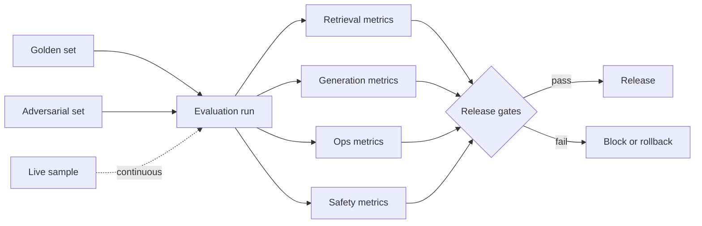

# AI Evaluation

> **Track:** AI Systems · **Prev:** AI Security · **Next:** Model Serving

## Learning objectives

After this chapter you can design an AI evaluation framework with metrics for retrieval, generation, agents, cost, and safety, and set release gates and rollback triggers.

## Overview

AI systems degrade silently: a model or prompt change can reduce groundedness or increase hallucination without an obvious error. Evaluation is the guardrail: define what good means, measure it continuously, and gate releases on metrics. RAG evaluation measures retrieval (recall, precision, ACL correctness) and generation (groundedness, citation accuracy, hallucination rate) separately. Agent evaluation measures task completion, tool-call accuracy, and unauthorized-action rate. Cost evaluation tracks tokens per request and cost per outcome.

## How it works

Build golden (labeled) and adversarial (injection, PII) test sets. Run them before every release and on a sample continuously. Measure retrieval metrics (recall@k, nDCG, ACL correctness), generation metrics (groundedness, answer correctness, citation accuracy, hallucination rate), operational metrics (TTFT, TPOT, tokens/s, cost/request), and safety metrics (refusal rate, injection pass rate, unauthorized actions, PII leaks). Set gates: release only if groundedness >= threshold, hallucination <= threshold, latency p99 <= SLO, cost <= budget. Rollback on regression.

## Architecture

## Capacity considerations

Evaluation runs add inference cost; sample continuously rather than full-run in production; golden sets are small but representative.

## Latency considerations

Offline evaluation does not affect users; continuous sample adds minimal load.

## Cost considerations

Evaluation inference (golden + adversarial sets); amortize across releases; use cheaper models for evaluation where possible.

## Security and privacy risks

Adversarial sets test injection and PII; keep them updated; rotate to avoid overfitting.

## Evaluation methodology

This IS the evaluation chapter. Key: separate retrieval from generation evaluation; use both golden and adversarial sets; set gates with rollback.

## Scaling strategy

Evaluation workers parallel; golden sets versioned; results stored for regression tracking.

## Trade-offs

Thorough eval (quality) vs speed. Golden set size (coverage) vs cost. Continuous (fresh) vs pre-release (thorough).

## When NOT to use this

Do not ship without eval gates; do not rely on vibes; do not use a single metric (groundedness without citation accuracy misses fabrication); do not skip adversarial tests.

## Common mistakes

No eval before release; relying on one metric; no adversarial set; no regression tracking; no rollback on eval failure.

## Failure modes

Eval set overfits (metrics improve, real quality drops); adversarial set stale; continuous sample too small to catch regressions.

## Practical exercise

Define release gates for a RAG feature: groundedness >= 0.9, hallucination <= 0.05, p99 < 3 s, cost <= $0.02/req. Show the rollback trigger.

## Interview questions

Why must retrieval and generation be evaluated separately? What is an adversarial eval set? What happens when a gate fails?

## Further reading

S-RAG; evaluation frameworks; templates/ai/evaluation-plan.md.

---
Prev: AI Security · Next: Model Serving
