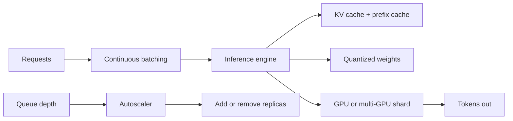

# Model Serving

> **Track:** AI Systems · **Prev:** AI Evaluation · **Next:** AI at Extreme Scale

## Learning objectives

After this chapter you can design a model-serving system with continuous batching, KV caching, quantization, distributed and multi-GPU inference, and autoscaling.

## Overview

Model serving is the inference platform: how you run a trained model to serve predictions at target latency and cost. The key techniques are continuous batching (group requests to maximize GPU utilization), KV caching (reuse attention state across tokens), quantization (reduce precision to fit bigger models), distributed inference (shard a model across GPUs), and autoscaling (add replicas with demand).

## How it works

Requests arrive at a serving engine. Continuous batching groups new requests into the same forward pass without waiting for a batch to fill, maximizing tokens/s/GPU. KV caching stores the attention key-value tensors so decode doesn't recompute them; prefix caching reuses KV across requests sharing a system prompt. Quantization (FP16 to INT8/INT4) halves or quarters model size and memory traffic at minor quality loss. For models larger than one GPU, tensor parallelism shards layers across GPUs (NVLink interconnect) or pipeline parallelism streams micro-batches. Autoscaling adds replicas on tokens/s or queue depth.

## Architecture

## Capacity considerations

Capacity = GPU count x tokens/s/GPU, bounded by VRAM for weights + KV cache. Continuous batching raises utilization; quantization raises capacity per GPU; multi-GPU shards large models.

## Latency considerations

Continuous batching trades per-request latency for throughput; TTFT bounded by prefill; TPOT by decode (memory-bound). Cap batch size for the latency SLO.

## Cost considerations

GPU-seconds dominate; utilization is the lever. Batching, quantization, and KV caching all raise tokens/s/GPU; autoscaling avoids idle GPUs.

## Security and privacy risks

Model weights are IP; isolate tenants; mTLS between serving replicas; rate-limit per tenant; no prompt logging with PII.

## Evaluation methodology

Benchmark real prompt-length distributions; report tokens/s, TTFT, TPOT, GPU utilization; compare quantization levels with the eval suite.

## Scaling strategy

Add replicas (horizontal); shard large models (tensor/pipeline parallel); autoscale on tokens/s and queue depth; multi-LoRA to serve many fine-tunes on one fleet.

## Trade-offs

Batch size (throughput) vs latency. Quantization (capacity) vs quality. Multi-GPU (big models) vs complexity/cost. KV cache (speed) vs VRAM.

## When NOT to use this

Do not over-quantize below eval tolerance; do not batch so large that latency collapses; do not shard a model that fits on one GPU; do not autoscale without a floor (cold starts).

## Common mistakes

No batching (low utilization); over-quantization without eval; KV cache OOM; no autoscaling floor; unbounded context consuming all VRAM.

## Failure modes

VRAM exhaustion on long contexts; straggler GPU in pipeline parallel; cold-start latency on scale-up; quality regression from over-quantization.

## Practical exercise

Size a serving fleet: 100 req/s, mean 1k input / 200 output tokens, 6k tokens/s/GPU, 80 GB VRAM, INT8 70B model. How many GPUs? How many concurrent contexts fit?

## Interview questions

Why does continuous batching improve utilization without waiting for a full batch? What does KV caching save? When does quantization hurt?

## Further reading

Inference engine docs; continuous batching papers; quantization references; LLM-inference case study.

---
Prev: AI Evaluation · Next: AI at Extreme Scale
