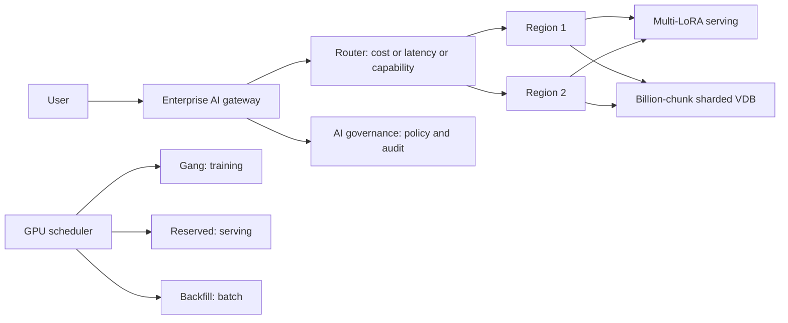

# AI at Extreme Scale

> **Track:** AI Systems · **Prev:** Model Serving · **Next:** LLM Gateways

## Learning objectives

After this chapter you can reason about multi-region AI serving, billion-chunk retrieval, multi-LoRA serving, GPU scheduling, enterprise AI gateways, large-scale evaluation, and AI governance.

## Overview

At extreme scale, AI systems face challenges beyond single-region serving: multi-region serving for latency and disaster recovery, billion-chunk retrieval (sharded vector indexes with fan-out), multi-LoRA (serve many fine-tuned models on one fleet), GPU cluster scheduling (gang scheduling for distributed training, mixing serving and batch), enterprise AI gateways (unified API across providers with routing, quotas, and budgets), large-scale evaluation (continuous evaluation across thousands of tenants), and AI governance (policies, audit, and compliance at scale).

## How it works

Multi-region serving places replicas near users; the AI gateway routes by latency, cost, and capability. Billion-chunk retrieval shards the vector index across many nodes with per-shard top-k and merge. Multi-LoRA loads a base model once and swaps LoRA adapters per request, serving many fine-tunes on one fleet. GPU scheduling uses gang scheduling for distributed training and backfill for batch, with reservations for latency-sensitive serving. Enterprise AI gateways provide a unified model API across providers with complexity/cost/capability routing, per-tenant token budgets, provider failover, and full audit. AI governance enforces policies (no auto-high-risk, no PII to unapproved models, audit) at the gateway level.

## Architecture

## Capacity considerations

Multi-region adds capacity and DR; billion-chunk requires sharded indexes; multi-LoRA saves GPU by sharing a base; GPU scheduling maximizes utilization.

## Latency considerations

Multi-region cuts user latency; billion-chunk adds fan-out + merge latency; gateway routing adds a hop but routes to the fastest model.

## Cost considerations

Multi-region duplicates infrastructure; multi-LoRA saves GPUs vs one model per fine-tune; GPU scheduling maximizes utilization; gateway routing cuts cost by matching model to task.

## Security and privacy risks

Gateway enforces governance policies at scale: per-tenant quotas, PII redaction, no unapproved external models, full audit; multi-region data sovereignty.

## Evaluation methodology

Continuous evaluation across tenants; per-tenant quality metrics; governance compliance dashboards; GPU utilization metrics.

## Scaling strategy

Multi-region active-active; sharded vector index fan-out; multi-LoRA adapter swapping; GPU cluster autoscaling; gateway horizontally scaled.

## Trade-offs

Multi-region (latency/DR) vs cost. Multi-LoRA (efficiency) vs adapter-management complexity. Gang scheduling (utilization) vs latency for serving. Gateway (centralized policy) vs SPOF.

## When NOT to use this

Do not multi-region before single-region is optimized; do not multi-LoRA if you have one model; do not gang-schedule a small cluster; do not centralize governance without HA.

## Common mistakes

No per-tenant budgets (cost runaway); billion-chunk with too few shards (hot shard); multi-LoRA adapter version drift; no governance audit; GPU underutilization from no backfill.

## Failure modes

Region failover untested; vector shard hotspot; adapter swap race; gateway outage (centralized SPOF); governance policy gap.

## Practical exercise

Design a multi-region AI gateway: route by capability (small for classification, large for analysis), per-tenant token budgets, provider failover, and a governance policy (no PII to external models).

## Interview questions

How does multi-LoRA serve many fine-tunes efficiently? Why does billion-chunk retrieval need sharding and fan-out? What does an enterprise AI gateway enforce?

## Further reading

Multi-LoRA papers; GPU scheduling; enterprise AI gateway; AI governance frameworks; LLM-inference case study.

---
Prev: Model Serving · Next: LLM Gateways
