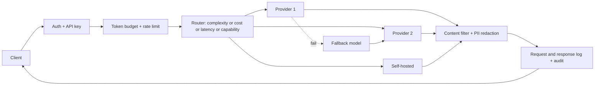

# LLM Gateways

> **Track:** AI Systems · **Prev:** AI at Extreme Scale · **Next:** Semantic Caching

## Learning objectives

After this chapter you can design an LLM gateway that provides a unified model API across providers with routing, quotas, budgets, failover, logging, and content filtering.

## Overview

An LLM gateway is the entry point for all LLM calls in an organization, analogous to an API gateway for traditional services but adapted for token-based workloads. It abstracts providers (OpenAI, Anthropic, self-hosted), routes by complexity/cost/latency/capability, enforces per-tenant token budgets and rate limits, fails over across providers, logs requests and responses, redacts PII, filters content, and audits. Conventional RPS limits are insufficient because a 20-token and a 100,000-token request differ by ~5,000x in compute and cost.

## How it works

A client calls the gateway with a unified API. The gateway authenticates (API key), checks token budget and rate limit (token-based, not RPS), routes to the best provider/model for the task (complexity-based: small model for classification, large for analysis; cost-based: cheapest capable model; latency-based: fastest region; capability-based: vision model for images), calls the provider, streams the response back, logs the request/response (with PII redaction), and records cost. On provider failure, it fails over to a fallback model. Content filtering blocks prohibited content before and after the call.

## Architecture

## Capacity considerations

Gateway is stateless and horizontally scaled; token-based quotas prevent one tenant from consuming all capacity. A 100k-token request is not the same as a 20-token one: budget by tokens, not requests.

## Latency considerations

Gateway adds a hop (~10 ms); routing decision is fast; streaming passthrough adds minimal latency. Failover adds latency on failure.

## Cost considerations

Gateway enables cost control: route cheap tasks to small models, expensive tasks to large. Per-tenant token budgets cap spend. Log tokens for cost attribution.

## Security and privacy risks

API key management and rotation; PII redaction before logging; content filtering; audit trail; never send confidential configs to unapproved external models; mTLS to providers.

## Evaluation methodology

Measure routing accuracy (did the right model handle the task?), cost per request, failover rate, latency overhead, content-filter false-positive rate.

## Scaling strategy

Gateway stateless behind a LB; shard token-budget store; provider credentials in secret manager; horizontal scale.

## Trade-offs

Centralized policy (consistency) vs SPOF. Routing (cost optimization) vs latency overhead. Token budgets (fairness) vs flexibility. Content filter (safety) vs false positives.

## When NOT to use this

Do not use RPS limits for LLMs (token-based is required); do not send confidential data to unapproved external models; do not skip PII redaction in logs; do not skip failover.

## Common mistakes

RPS-only rate limiting; no per-tenant budgets (cost runaway); no PII redaction in logs; no failover (single provider SPOF); no cost attribution.

## Failure modes

Provider outage without failover; budget store down (fail-open or fail-closed?); content filter blocks legitimate traffic; routing sends simple tasks to expensive models.

## Practical exercise

Design a gateway that routes: classification to a small model ($0.50/M tokens), analysis to a large model ($10/M tokens), and confidential configs to a local model. Show token-budget enforcement for a tenant with a $100/day cap.

## Interview questions

Why are RPS limits insufficient for LLMs? What does an LLM gateway route by? How do you enforce a per-tenant token budget? What happens on provider failure?

## Further reading

LLM gateway patterns; API gateway: Level 2; rate limiting: Level 5; AI safety gateway.

---
Prev: AI at Extreme Scale · Next: Semantic Caching
