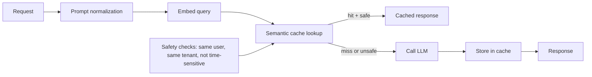

# Semantic Caching

> **Track:** AI Systems · **Prev:** LLM Gateways · **Next:** (end of AI track)

## Learning objectives

After this chapter you can design a semantic cache that returns equivalent answers without calling the LLM, with safety controls for when semantic equivalence is unsafe.

## Overview

A semantic cache stores LLM responses and returns them for semantically similar future queries, avoiding the LLM call entirely. Unlike exact-match caching, it uses embedding similarity to detect that two different phrasings ask the same question. The challenge: semantically similar requests are not always interchangeable, especially for financial information, medical advice, user-specific data, time-sensitive information, and authorization-dependent answers.

## How it works

On a request: normalize the prompt (strip whitespace, standardize casing); embed the normalized prompt; search the cache by embedding similarity; if a cached entry exceeds the similarity threshold AND passes safety checks (same user/tenant, same permissions, not time-sensitive, not user-specific), return the cached response. Otherwise call the LLM and store the result. Cache entries are namespaced by user, tenant, model, and prompt version. Invalidation: TTL for freshness; model/version change invalidates all; explicit invalidation for updated data.

## Architecture

## Capacity considerations

Cache hits avoid LLM calls entirely (free); misses cost full LLM inference. Hit ratio is the lever; high-cardinality queries have low hit ratios.

## Latency considerations

Cache hit returns in ~ms (embedding + lookup); cache miss pays full LLM latency. Net latency improves with hit ratio.

## Cost considerations

Cache hits cost ~0 (just embedding for the lookup); misses cost full LLM. Even a 20 percent hit rate cuts ~20 percent of LLM cost. Embedding cost for lookups is small.

## Security and privacy risks

CRITICAL: cache entries must be namespaced by user and tenant; a hit for user A must not be returned to user B. Time-sensitive answers (stock prices, news) must not be cached. Authorization-dependent answers must not be served across permission boundaries. PII must be redacted before storing.

## Evaluation methodology

Measure hit ratio, false-positive rate (cached answer was wrong for the new query), cost savings, latency improvement. False positives are the key risk.

## Scaling strategy

Cache sharded by tenant; embedding index (vector DB) for similarity lookup; TTL eviction; LRU for memory management.

## Trade-offs

Similarity threshold (high = safe, low hit ratio; low = risky, high hit ratio). Namespacing (safe, lower hit ratio; shared, risky). TTL (fresh, lower hit ratio; long, stale).

## When NOT to use this

Do NOT use semantic caching for: financial information, medical information, user-specific data, time-sensitive information, authorization-dependent answers, or transactional requests. Semantically similar does not mean safely interchangeable.

## Common mistakes

Cross-tenant cache leakage; caching time-sensitive data (stale answers); threshold too low (wrong answers); no prompt-version awareness (stale answers after prompt change); no model-version invalidation.

## Failure modes

Cross-tenant leak (user B gets user A cached answer); stale answer for time-sensitive data; false-positive match (semantically similar but factually different); cache poisoning.

## Practical exercise

Design a semantic cache for a support bot. Define which query types are safe to cache (general knowledge) vs unsafe (account-specific, time-sensitive). Set the similarity threshold and namespace strategy.

## Interview questions

When is semantic caching unsafe? What must be namespaced per user or tenant? What is a false-positive cache match and why is it dangerous? What is the hit ratio vs safety trade-off?

## Further reading

Semantic caching references; GPTCache; Redis vector search; vector databases chapter.

---
Prev: LLM Gateways · Next: (end of AI track)
