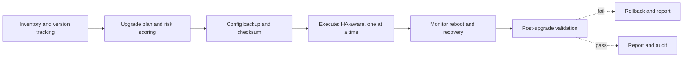

# Firmware Upgrade Lifecycle

> **Prev:** Firewalls, VPN, Segmentation and Zero-Trust | **Next:** AI for Network Operations

## Learning objectives

After this chapter you can explain the full firmware lifecycle: inventory, version tracking, end-of-support, security advisories, upgrade planning, backup/rollback, execution, and validation.

## Overview

Network device firmware lifecycle management is the process of keeping devices on supported, secure firmware versions. It starts with inventory and version tracking, monitors end-of-support dates and security advisories, plans upgrades with compatibility and risk analysis, backs up configurations, executes upgrades in maintenance windows with HA-pair awareness, validates post-upgrade, and rolls back on failure. Every step is audited.

## How it works

Inventory discovers devices and records current firmware. A catalog tracks target versions, release notes, advisories, and compatibility. An upgrade plan scores risk (advisories, HA, dependencies, rollback readiness). Pre-upgrade: backup config + checksum, health checks. Execution: upgrade one device at a time in an HA pair (maintain service), monitor reboot. Post-upgrade: validate reachability, services, performance. On failure: rollback to previous firmware and config. Report and audit.

## Architecture

## Trade-offs

Automation (speed, consistency) vs human approval (safety). Backup (safety, time) vs no-backup (fast, risky). HA-aware (safe, slow) vs parallel (fast, risky). AI risk scoring (adaptive) vs deterministic checks (reliable).

## When NOT to use this

See trade-offs above; do not apply a pattern where a simpler approach suffices.

## Common mistakes

No backup before upgrade; upgrading both HA peers simultaneously; ignoring advisories; no rollback path; upgrading outside maintenance windows; no post-upgrade validation.

## Failure modes

Device bricked by bad firmware; HA pair both down; config lost without backup; validation misses a regression; rollback fails.

## Review questions

1. Why upgrade one HA peer at a time? 2. What must happen before executing an upgrade? 3. When is rollback triggered? 4. Why track end-of-support dates? 5. What is the risk of ignoring security advisories?

## Further reading

Firmware lifecycle references; device upgrade management case study; upgrade_risk.py tool; Level 6 reliability.

---
Prev: Firewalls, VPN, Segmentation and Zero-Trust | Next: AI for Network Operations
