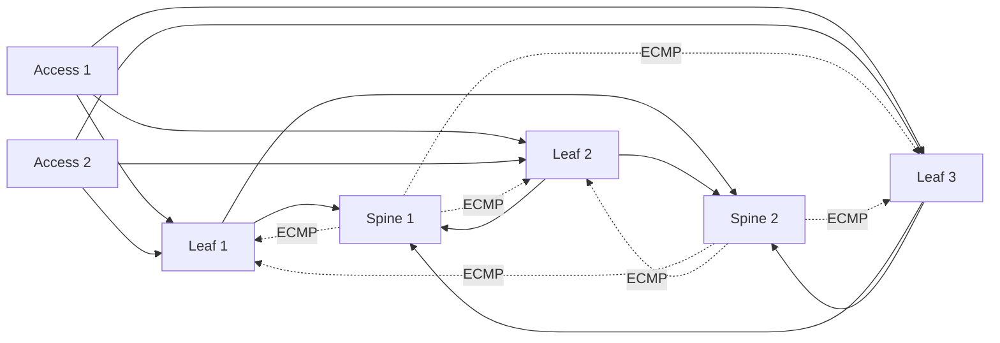

# Switching, Routing and Network Topologies

> **Prev:** Start of Network Foundations | **Next:** Syslog and Network Monitoring

## Learning objectives

After this chapter you can explain Layer 2 switching, Layer 3 routing, VLANs and trunking, common routing protocols (OSPF, BGP), and topology patterns (leaf-spine, three-tier, full-mesh).

## Overview

Network infrastructure relies on switching at Layer 2 (MAC-based forwarding within a broadcast domain) and routing at Layer 3 (IP-based forwarding between subnets). VLANs segment broadcast domains; trunking carries multiple VLANs between switches. Routing protocols like OSPF (interior, link-state) and BGP (exterior, path-vector) exchange reachability information. Topology choices trade scale, latency, and cost.

## How it works

Switches learn MAC addresses and forward frames within a VLAN. Routers maintain routing tables built by protocols: OSPF floods link-state advertisements within an area to compute shortest paths; BGP exchanges prefix reachability between autonomous systems using path attributes. Leaf-spine topologies provide non-blocking any-to-any connectivity with ECMP; three-tier hierarchies aggregate traffic north-south; mesh topologies minimize hops but scale poorly.

## Architecture

## Trade-offs

Leaf-spine (scale, ECMP, predictable latency) vs three-tier (familiar, cheaper for small scale) vs mesh (lowest latency, does not scale). OSPF (fast convergence, area-scoped) vs BGP (policy-rich, slower). VLAN segmentation (isolation) vs complexity.

## When NOT to use this

See trade-offs above; do not apply a pattern where a simpler approach suffices.

## Common mistakes

Oversubscribed uplinks; VLAN spanning without trunk pruning; BGP without route filtering; flat L2 at scale (broadcast storms).

## Failure modes

Broadcast storm from a loop without STP; routing blackhole from a misconfigured aggregate; ECMP polarization; OSPF area border overload.

## Review questions

1. When is leaf-spine preferred over three-tier? 2. What does OSPF compute and how? 3. Why is BGP used between autonomous systems? 4. What causes an L2 broadcast storm? 5. Why prune VLANs on trunks?

## Further reading

OSPF RFC 2328; BGP RFC 4271; Clos and leaf-spine references; Level 0 networking chapter.

---
Prev: Start of Network Foundations | Next: Syslog and Network Monitoring
