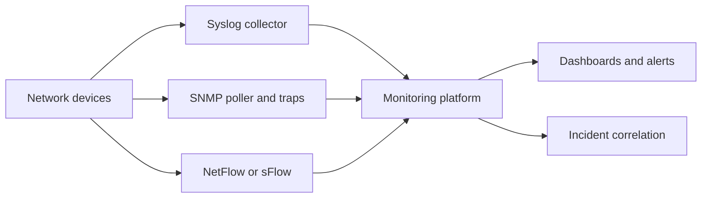

# Syslog, SNMP, NetFlow and Network Monitoring

> **Prev:** Switching, Routing and Topologies | **Next:** Network Automation and Configuration Management

## Learning objectives

After this chapter you can explain syslog collection (UDP/TCP/TLS), SNMP polling and traps, NetFlow/sFlow for traffic visibility, and how these feed network monitoring and incident response.

## Overview

Network observability uses three complementary data sources: syslog (event logs from devices), SNMP (polled metrics like CPU, memory, interface counters), and NetFlow/sFlow (sampled traffic flow records). Together they provide events, metrics, and traffic visibility. Modern platforms enrich them with normalization, correlation, and AI classification to produce actionable incidents.

## How it works

Syslog messages are sent by devices to collectors (UDP 514 default, or TCP/TLS for reliability). SNMP polls devices for OIDs (CPU, memory, interface stats) at intervals and receives traps for events. NetFlow exports flow records (src/dst/ports/bytes) for traffic analysis. A monitoring platform ingests all three, normalizes, correlates, and presents dashboards and alerts.

## Architecture

## Trade-offs

Syslog (event visibility, push) vs SNMP (metric polling, pull) vs NetFlow (traffic visibility, heavy). TLS syslog (secure) vs UDP (fast, lossy). Polling interval (freshness) vs device load.

## When NOT to use this

See trade-offs above; do not apply a pattern where a simpler approach suffices.

## Common mistakes

SNMP polling too aggressively (device CPU); UDP syslog without buffering (message loss); no NetFlow sampling tuning; alert fatigue from no correlation.

## Failure modes

UDP syslog drop under burst; SNMP timeout on overloaded device; NetFlow exporter overwhelm; collector SPOF without redundancy.

## Review questions

1. What are the three main network observability data sources? 2. Why use TLS syslog instead of UDP? 3. What does NetFlow tell you that syslog does not? 4. What is the trade-off in SNMP polling interval? 5. Why correlate events before alerting?

## Further reading

Syslog RFC 5424; SNMP RFC 1157; NetFlow references; Level 8 observability; intelligent syslog monitoring case study.

---
Prev: Switching, Routing and Topologies | Next: Network Automation and Configuration Management
