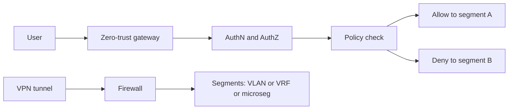

# Firewalls, VPN, Segmentation and Zero-Trust Networking

> **Prev:** Configuration Management and Change Automation | **Next:** Firmware Lifecycle Management

## Learning objectives

After this chapter you can explain firewall policies, VPN tunneling, network segmentation with VLANs and microsegmentation, and the zero-trust networking model applied to infrastructure.

## Overview

Network security controls traffic with firewalls (stateful packet inspection, next-gen with DPI), VPNs (encrypted tunnels for remote access and site-to-site), segmentation (VLANs, VRFs, microsegmentation for blast-radius containment), and zero-trust (authenticate every connection, no implicit trust by network location). Defense in depth layers these controls.

## How it works

Firewalls inspect packets against policies (5-tuple, application, user). VPNs encrypt traffic over untrusted networks (IPsec for site-to-site, TLS for remote access). Segmentation isolates zones: VLANs at L2, VRFs at L3, microsegmentation per workload. Zero-trust replaces network-location trust with identity-based access: every request is authenticated and authorized regardless of source network.

## Architecture

## Trade-offs

Firewall (inspected, slow) vs routing (fast, uninspected). Segmentation (isolation, complexity) vs flat (simple, wide blast radius). Zero-trust (secure, per-connection authN) vs traditional (trusted internal, faster). VPN (encrypted, overhead) vs direct.

## When NOT to use this

See trade-offs above; do not apply a pattern where a simpler approach suffices.

## Common mistakes

Firewall rules accumulating without cleanup (rule bloat); VPN with weak crypto; flat network with no segmentation (wide blast radius); zero-trust without device posture (incomplete).

## Failure modes

Firewall misconfig blocking legitimate traffic or allowing unintended; VPN tunnel down (site isolated); segmentation too granular (management overhead); zero-trust gateway SPOF.

## Review questions

1. What is the zero-trust model and how does it differ from a trusted internal network? 2. When is microsegmentation worth its complexity? 3. What is firewall rule bloat and how do you prevent it? 4. Why use IPsec for site-to-site vs TLS for remote access? 5. What is the blast radius of a flat vs segmented network?

## Further reading

Zero-trust references; firewall policy best practices; IPsec RFC 4301; Level 7 security; network-ai-security-review template.

---
Prev: Configuration Management and Change Automation | Next: Firmware Lifecycle Management
